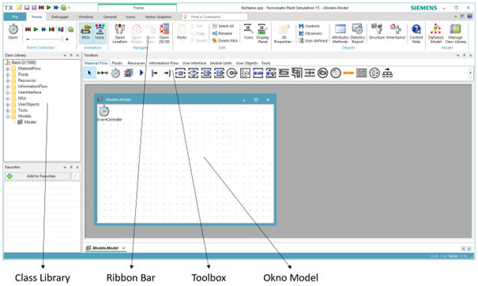

# Hlavné okno softvéru Plant Simulation



Aplikácia Tecnomatic Plant Simulations sa spúšťa poklepaním na ikonu&#x20;

<figure><figcaption></figcaption></figure>

v ponuke štart alebo na ploche systému Windows. Otvorí sa hlavné okno aplikácie. V tomto štádiu nie je aktívny žiadny projekt, ale je možné vybrať základné informácie o používaní aplikácie, ktoré sú rozdelené do troch skupín: Models, Getting started a Web. Projekt sa otvára poklepaním na položku v menu File-New, po ktorej je na výber vytvárať projekt v 2D alebo 3D. Na začiatok je vhodné začať s projektom v 2D, pričom v priebehu tvorby projektu je kedykoľvek možné rozšíriť projekt o možnosť 3D. Hlavné okno softvéru s prázdnym 2D projektom zobrazuje obrázok.

<figure><figcaption>
Hlavné okno programu Plant simulation
</figcaption></figure>

Hlavné okno aplikácie je rozdelené do štyroch základných oblastí:

·       [Ribbon Bar](hlavne-okno-softveru-plant-simulation/ribbon-bar.md)

·       [Class Library](hlavne-okno-softveru-plant-simulation/class-library.md)

·       [Toolbox](hlavne-okno-softveru-plant-simulation/toolbox.md)

·       Okno Model

·       Ribbon Bar
