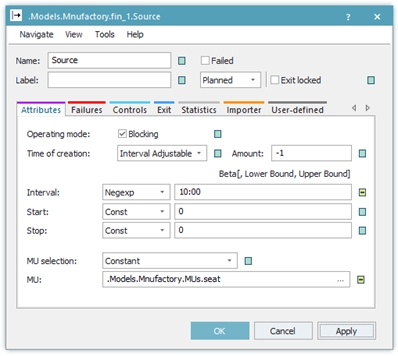

# Cvičenie: Pracovná stanica pre montáž autosedačiek

Cieľ: Vytvorenie jednoduchého simulačného modelu ktorý na základe zadaných vstupných dát bude simulovať prácu montážneho pracoviska autosedačiek. Vstupné údaje sú nasledovné:

Doba medzi príchodom základovej konštrukcie sa riadi podľa exponenciálneho rozdelenia so strednou hodnotou 10 min,

&#x20;Doba kompletizácie sa riadi podľa normálneho rozdelenie NORM(10,2,5,20) min,

&#x20;Doba na prepravu po prepravníku je 30 sekúnd k pracovnej stanici a 30 sekúnd od pracovnej stanice.

Cieľ úlohy: zistite

využitie pracovnej stanice,

počet skompletizovaných sedačiek za 960 minút (16 hodín),

ako dlho sa priemerne  zdržala jedna sedačka v systéme.

Tvorba simulačného modelu

Postup tvorby simulačného modelu je nasledujúci. Najskôr pod zložku Models vytvoríme zložku Manufactory do ktorej vložíme frame, ktorý premenujeme na fin\_1.

Na frame vložíme nasledujúce objekty:

1x-Source

2x-Conveyor

1x-Buffer

1x-Station

1x-Drain

Do zložky Manufactory pridáme zložku MUs a do nej prekopírujeme Part ktorý premenujeme na seat. Komponenty prepojíme konektorom podľa nasledovného obrázka:

<figure><figcaption>
Vzhľad simulačného modelu výroby autosedačiek
</figcaption></figure>

Následne je možné nastaviť všetky komponenty modelu podľa požiadaviek. Nastavenie komponenty Source, generovanie príchodu základovej konštrukcie ako Part nazvaného seat v časovom intervale Negexp na 10min podľa obrázka:

<figure><figcaption>
Nastavenie karty Attributes objektu Source
</figcaption></figure>

Nastavenie oboch dopravníkov Conveyor aj Conveyor1 na 30 sekúnd.

<figure><figcaption>
Nastavenie dopravníkov objekty Conveyor
</figcaption></figure>

Pred stanicou na ktorej sa vykonáva samotná operácia čalúnenia ja vložený zásobník Buffer, na ktorom je nastavená neobmedzená kapacita.

<figure><figcaption>
Nastavenie zásobníka objekt Buffer
</figcaption></figure>

Samotný proces šitia čalúnenia ja na stanici Station , kde je definované chovanie pomocou distribučnej funkcie s normálovým rozdelením. Pretože normálové rozdelenie môže nadobúdať záporné hodnoty, sú nastavené krajné medze generovaných časov.

<figure><figcaption>
Nastavenie časovej distribúcie objektu Station
</figcaption></figure>

Objekt Drain je ponechaný na defaultných hodnotách.

Dĺžka simulácie sa nastavuje pomocou komponenty EventController na karte Settings.

<figure><figcaption>
Nastavenie objektu EventController
</figcaption></figure>
