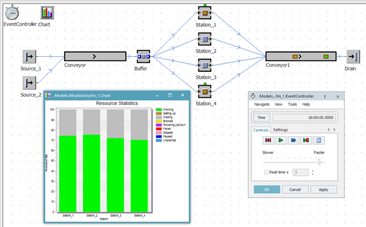
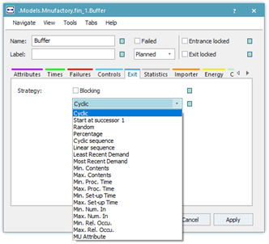
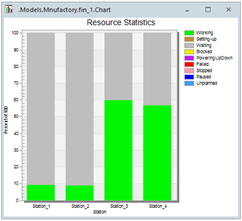
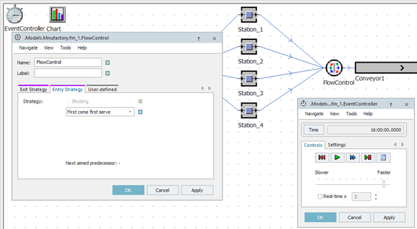

# Exit strategia a objekt FlowControl

V prípade, že použijeme nastavenie z predošlého príkladu, pre plynulý beh simulácie bez efektu zapĺňania sa objektu Buffer, potrebujeme štyri objekty station. Ak použijeme graf na znázornenie vyťažiteľnosti staníc vidíme, že každá stanica je vyťažená niečo málo nad 70%. Ako ukazuje obrázok:

<figure><figcaption>
Ukážka rovnomerného využitia objektov Station
</figcaption></figure>

Z objektu Buffer vystupujú štyri objekty Connector. AKým spôsobom sa prerozdelujú objekty MUs na jednotlivé konektory má zásadný vplyv na priebeh simulácie a výsledok simulačného modelu. Nastavenie prerozdelovania MUs na výstupné konektory sa nachádza na karte Exits daného objektu(v našom prípade objektu Buffer) obrázok:

<figure><figcaption>
Ukážka možností nastavenia karty Exit(Exit Strategy)
</figcaption></figure>

Implicitne je táto hodnota nastavené na Cyclic, to znamená že výstup sa cyklicky prepína v danom poradí. Zmeňme nastavenie objektov station nasledovne: Processing Time: objektu Station\_1 a Station\_2 na Const 1:0. Výsledok na simulačný model a Working Time znázorňuje obrázok.

<figure><figcaption>
Ukážka využiteľnosti staníc v súvislosti s nastavením Exit Strategy
</figcaption></figure>

Nakoľko sa MUs prerozdeluju z objektu buffer cyklicky, musí objekt Station\_1 a Station\_2 čakať na pomalšie pracujúce objekty Station\_3 a Station\_4. V prípade že nastavíme Exit stratégiu objektu na Most Recent Demand (posledný dopyt), situácia sa zmení. Kartu nastavenia Exit obsahujú objekty, kde je možné pripojiť viacej objektov Connector. V prípade že potrebujeme riadiť aj vstupné pravidlá je možné použiť objekt FlowControl , ktorý sa nachádza na karte Material Flow. V prípade objektu FlowControl je možné nastaviť vstupnú (Entry Strategy), ale aj výstupnú (Exit Strategy) stratégiu obrázok:

<figure><figcaption>
Ukážka nastavenie Entry Strategy objektu FlowControl
</figcaption></figure>

