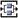
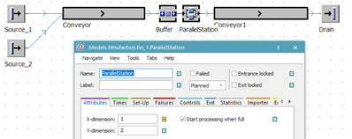
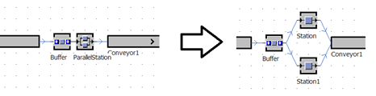

# Objekt ParallelStation

Objekt ParallelStation  je rozšírenie objektu Station o možnosť simulovať niekoľko objektov Station jedným objektom. Na základnej karte Attributes sa nachádza nastavenie X-dimension a Y-dimension. V prípade že chceme simulovať dve pracovné stanice nastavíme X-dimension na 2 a y Dimension na 1.

Cvičenie: Pracovná stanica pre montáž autosedačiek s dvoma pracoviskami, s monotovaním dvoch typov autosedačiek:

Cieľ: Vytvorenie jednoducheho simulačného modelu ktorý na základe zadaných vstupných dát bude simulovať prácu montážneho pracoviska autosedačiek. Vstupné údaje sú nasledovné:

Doba medzi príchodom základovej konštrukcie prvého typu sa riadi podľa exponenciálneho rozdelenia so strednou hodnotou 5 min, druhého typu 11 min,

&#x20;Doba kompletizácie sa riadi podľa normálneho rozdelenie TRIA(10,8,12) min,

&#x20;Doba na prepravu po prepravníku je 30 sekúnd k pracovnej stanici a 45 sekúnd od pracovnej stanice.

Cieľ úlohy: zistite

využitie pracovnej stanice,

počet skompletizovaných sedačiek za 960 minút (16 hodín),

ako dlho sa priemerne  zdržala jedna sedačka v systéme.

Tvorba simulačného modelu

Namiesto objektu Station je v simulačnom modeli použitý model ParallelStation ako ukazuje obrázok:

<figure><figcaption>
Ukážka použitia a nastavenie objektu ParallelStation
</figcaption></figure>

Samostatné cvičenie: Porovnanie Objektov Station s Objektom ParallelStation.

Vytvorený simulačný model s použitím objektu ParallelStation porovnajte so simulačným modelom vytvoreným pomocou dvoch objektov Station ako ukazuje obrázok:

<figure><figcaption>
Porovnanie použitia objektu ParallelStation a objektov Station
</figcaption></figure>

Samostatné cvičenie: Nájdite potrebný počet staníc pre plynulý chod simulácie(zabránenie zapĺňaniu objektu Buffer):

