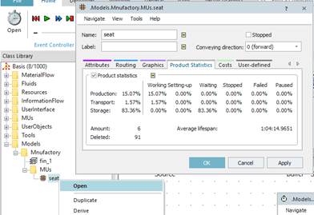

# Počet skompletizovaných sedačiek za 960 minút (16 hodín)

Skompletizované množstvo sedačiek je možné určiť tak, že zistíme počet MU ktoré opustilo systém. MU opúšťajú systém pomocou komponenty Drain. Otvorením vlastností komponenty Drain na karte Statistic je možné nájsť hodnotu Exits, čo reprezentuje počet MU ktoré opustia simulačný model, teda v našom prípade sa jedná o počet skompletizovaných sedačiek.

Ako dlho sa priemerne  zdržala jedna sedačka v systéme

Základnú štatistiku všetkých vygenerovaných MUs daného typu a mena, je možné znázorniť pomocou karty Product Statistics otvorením Open daného objektu MU ktorý je v adresári MUs Class Library. Štatistiku všetkých objektov seat znázorňuje obrázok:

<figure><figcaption>
Zobrazenie štatistiky mobilných objektov Seat
</figcaption></figure>

V tomto konkrétnom príklade bolo objektom Drain zmazaných 91 objektov seat, 6 objektov seat sa stále nachádza v simulačnom modeli, čiže celkovo ich bolo vygenerovaných 97. Priemerný čas ktorý strávil objekt seat v simulačnom modely bol (Average lifespan:): 1hod, 4 min a 14,9651 sekúnd. Taktiež je na tejto karte možné zhliadnuť štatistiku (Working, Setting-up, Waiting, Stopped, Failed a Paused) objektov počas práce (Production), presúvaní sa (Transport) a uskladnenia (Storage).
