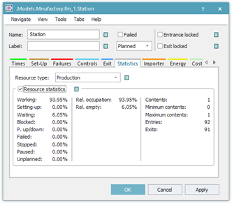

# Výsledky cieľov úlohy

Pri určovaní výsledkov je potrebné aby prebehla celá simulácia do konca požadovaného času. Simuláciu je možné urýchliť tlačidlom Start Fast Forward Simulation ktorý sa nachádza na karte Home alebo je ho možné nájsť po otvorení vlastností EventController

Využitie pracovnej stanice:

Otvorením vlastností Station a prepnutím na kartu Statistic je možné vidieť množstvo informácií prislúchajúcich objektu Station. Zoznam dát karty Statistics a ich vlastností sumarizuje tabulka.

<figure><figcaption>
Zobrazenie štatistických údajov objektu Station
</figcaption></figure>

|                     |                                                                                                       |
| ------------------- | ----------------------------------------------------------------------------------------------------- |
| Working:            | Štatisticky zobrazuje obdobie počas ktorého stanica pracovala.                                        |
| Setting-up:         | Štatisticky zobrazuje obdobie pačas ktorého sa stanica uvádzala do prevádzky.                         |
| Waiting:            | Štatictický zobrazuje obdobie počas ktorého stanica čakala na materiál.                               |
| BLocked:            | Štatisticky zobrazuje obdobie počas ktorého bola stanica blokovaná.                                   |
| Powering up/down:   | Štatisticky zobrazuje obdobie potrebné na zapínanie a vypínanie stanice.                              |
| Failed:             | Štatisticky zobrazuje obdobie počas ktorého bola stanica nefunkčná.                                   |
| Stopped:            | Štatisticky zobrazuje obdobie počas ktorého bola stanica nefunkčná(npr. z dôvodu nedostatku energií). |
| Paused:             | Štatisticky zobrazuje obdobie počas ktorého stanica stála z dôvodu prestávky.                         |
| Unplanned:          | Štatisticky zobrazuje obdobie počas ktorého bola stanica odstavená neplánovane.                       |
| Reltive occupation: | Štatisticky zobrzuje obdobie počas ktorého bol v stanici objekt material flow.                        |
| Relative empty:     | Štatisticky zobrazuje obdobie počas ktorého bola stanica k dispozícii ale nepracovala.                |
| Contens:            | Zobrazuje množstvo MUs objektov ktoré stanica obsahuje.                                               |
| Minimum Contens:    | Zobrazuje minimálne množstvo objektov MUs ktoré stanica obsahovala počas simulácie.                   |
| Maximum Contens:    | Zobrazuje maximálne množstvo objektov MUs ktoré stanica obsahovala počas simulácie.                   |
| Entries:            | Zobrazuje množstvo objektov MUs, ktoré do stanice vstúpili.                                           |
| Exits:              | Zobrazuje množstvo objektov MUs, ktoré zo stanice vystúpili.                                          |

