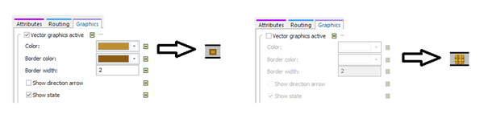

# Editor ikon a vektorová grafika

Softvér Plant simulation umožňuje vytvárať a modifikovať objekty tak aby graficky spĺňali podmienky ktoré požadujeme aby zobrazovali. K dispozícii je možnosť zobrazovania bitmapovou grafikou, alebo vektorovou grafikou. Bitmapová grafika je náročnejšia na hardverový výkon počítača, avšak umožňuje zobrazovať objekty intuitívne v akejkoľvek veľkosti a farbách. Napríklad zmenu zobrazenie objektu MU typu Part je možné vykonať na karte Graphics zaškrtnutím políčka Vector graphics active. Zobrazenia objektu MU Part formou štandardnej bitmapy a formou vektorovej grafiky zobrazuje obrázok:

<figure><figcaption>
Ukážka grafickej zmeny MU
</figcaption></figure>

V prípade, že používame vektorovú grafiku MU objektu Part je možné meniť základné zobrazenie (farbu, šírku orámovania atď..). V prípade, že používame bitmapové zobrazenie, je možné priradiť objektu \*.bmp obrázok alebo využiť na editáciu editor ikon.
