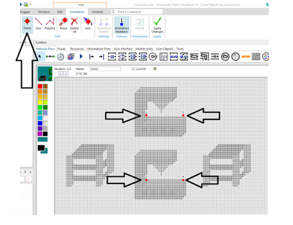
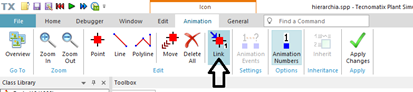
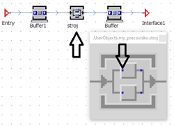
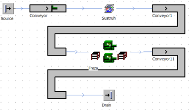
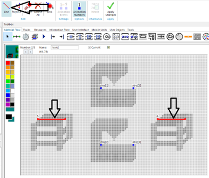
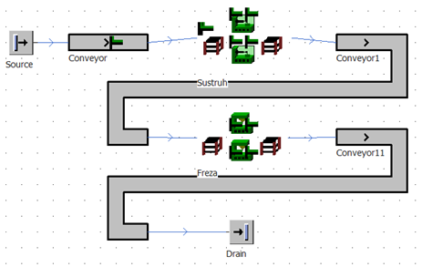

# Animácia ikony

Pokiaľ chceme vedieť ako sa správajú objekty v jednotlivých SubFrame objektoch ktoré sme vytvorili (Sústruh a Fréza), je potrebné tieto objekty otvoriť, a následne je vidieť ako sa MUs pohybujú. Táto situácia sa dá zjednodušiť tak, že vytvoríme animáciu objektov sobFrame nasledovne: Otvoríme editor ikon objektu Fréza pravým tlačidlom myši a výberom Edit Icons… Na Ribon Bare sa prepneme z karty Edit na kartu Animation. Možnosti výberu na príkazov sa zmenia a zobrazenie obrázku ikony bude šedé. Vyberte tvorbu bodov pomocou Point, a vytvoríme štyri body podľa obrázka (ľavým tlačidlom myši sa body vytvárajú, pravým sa mažú).

<figure><figcaption>
Ukážka tvorby animačných bodov ikony objektu SubFrame
</figcaption></figure>

Teraz je možné body prelinkovať z pôvodne vytvoreným obiektom. výberom funkcie Link obrázok.

<figure><figcaption>
Poloha funkcionality Link v editore ikon
</figcaption></figure>

Kliknutím na červený bod sa otvorí model, ktorý sme vytvorili. Následne výberom objektu stroj sa otvorí zväčšená ikona objektu s modrými bodmi, ktoré je následne možné vybrať ľavým tlačidlom myši. Postup ukazuje obrázok:

<figure><figcaption>
Ukážka prelinkovania ikony s objektom
</figcaption></figure>

Postup opakujem 4 krát pre každý bod. Potvrdením zmien editora ikon pomocou tlačidla Apply Changes, prepnutím sa do hlavného okna a spustením simulácie sa zmena prejaví tak, že na grafickom vyobrazení objektu Fréza sa začnú zobrazovať objekty MUs ako ukazuje obrázok:

<figure><figcaption>
Ukážka simulačného modlu s animáciou ikony objektu SubFrame
</figcaption></figure>

Týmto spôsobom bolo prelinkovanie zobrazenia stroja na objekt subFrame. Rovnakým spôsobom je možné prelinkovať aj zobrazenie Objektov Buffer nasledovne: Prepneme sa do okna editora ikon, kde vytvoríme dve úsečky pomocou funkcie Line v mieste kde chceme aby sa zobrazovali MUs keď budú v zásobníku obrázok:

<figure><figcaption>
Ukážka prelinkovania objektu Buffer
</figcaption></figure>

Následne je možné tieto úsečky prelinkovať z objektami Buffer pomocou funkcie Link obrázok.

Rovnakým spôsobom je možné vytvoriť a prelinkovať ikonu, ktorá bude reprezentovať pracoviská sústruhu. Výsledok využitia bitmapovaje grafiky s prelinkovaným zobrazením ukazuje obrázok:

<figure><figcaption>
Výsledný simulačný model dielne s vlastnou animáciou
</figcaption></figure>
