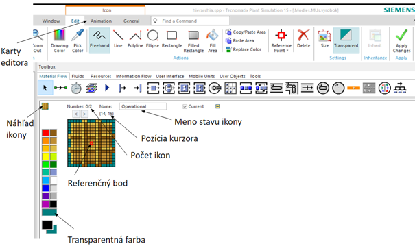

# Editor ikon

Editor ikon je možné otvoriť poklepaním pravým tlačidlom na objekt s výberom položky Edit Icons... (ikonu MU vyrobok editujeme tak, že v Class Library vyberieme MU objekt vyrobok pravým tlačidlom myši a následne položku Edit Icons... ). Otvorí sa editor ikon, jeho vzhľad z jednoduchým popisom ukazuje obrázok:

<figure><figcaption>
Vzhľad a ovládania editora ikon
</figcaption></figure>

Pracovné prostredie editora ikon má tri karty Ribon baru (Edit, Animation a General). Pri prvotnom otváraní sa implicitne otvárí karta Edit. V prípade objektu MU Part sú k objektu pridružené dve ikony (Waiting a Operational) medzi ktorými je možné sa prepínať pomocou šípok . MU objekt Part nadobúda stavy Waiting a Operational, ktorým prislúchajú dané ikony .
