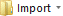
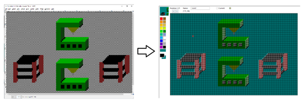
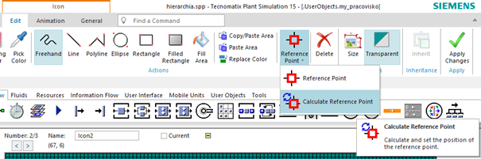
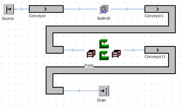

# Pridanie ikony ako obrázka zo súboru

Možnosti editora ikon ktorý sa nachádza ako súčasť softvéru plant simulation nemusia vyhovovať grafickým potrebám užívateľa. Je možné vytvoriť obrázok v externom editore a tento následne po importe do editora ikon využívať v simulačnom modeli. Je vhodné vytvárať obrázok tak, aby obsahoval transparentnú vrstvu, čím sa zjednodušuje práca s obrázkom. Jednoduchú animáciu môžeme vytvoriť na nami vytvorenom objekte my\_pracovisko z predchádzajúceho príkladu. Pravým tlačidlom myši otvoríme editor ikon. Následne v sekcii File na Ribon Bare zvolíme New  a potom Import . Po na-importovaní môže výsledok vyzerať ako ukazuje obrázok:

<figure><figcaption>
Príklad importu grafického súboru do editora ikon
</figcaption></figure>

Veľkosť obrázku je väčšia 115x74 čo ma za následok, že referenčný bod sa nachádza v ľavej hornej štvrtine, čo je nežiadúce. Obyčajne je referenčný bod v strede obrázka, pretože od tohto bodu sa odvodzujú všetky ostatné zobrazované časti objektu. Pokiaľ je aktívna karta edit, poklepaním na šípku dole ikony Reference Point sa zobrazí možnosť Calculate Reference Point po ktorej zvolení sa prepočíta pozícia referenčného bodu na stred obrázka. Výber možnosti znázorňuje obrázok:

<figure><figcaption>
Ukážka rekalkulácie referenčného bodu ikony
</figcaption></figure>

Aby sa ikona zobrazila v simulačnom modeli je potrebné zaškrtnúť voľbu Current a výsledok nastavenia potvrdiť Apply Changes vpravo hore na Ribon Bare. Pokiaľ necháme na objekte Sústruh volnu Current zaškrtnutú na Default a na objekte fréza použijeme ikonu naimportovanú zo suboru výsledok simulačného modelu bude ako na obrázku:

<figure><figcaption>
Ukážka objektu SubFrame s vlastnou grafikou
</figcaption></figure>

Rovnakým spôsobom je možné pridať iné zobrazenia v prípade objektu sústruh.
