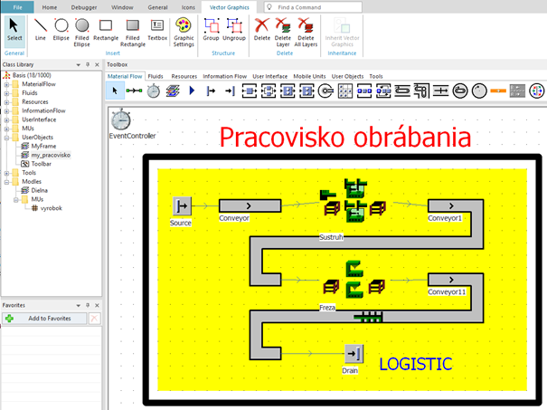

# Vektorová grafika

Pokiaľ sme na hlavnom objekte Frame je možné sa prepnúť na kartu Vector Graphics kde je možné na hlavné okno vkladať základné prvky vektorovej grafiky (body, úsečky, text), nastavovať ich veľkosť a vzhľad. Výsledný simulačný model s použitím vektorovej grafiky môže mať vzhľad ako na obrázku:

<figure><figcaption>
Ukážka použitia vektorovej grafiky
</figcaption></figure>
