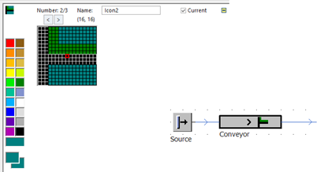

# Vytváranie vlastnej ikony pomocou editora ikon

Poklepaním na ikonu , sa do editora vloží nová ikona. Teraz je možné využiť prvky editora a navrhnúť vlastný obrázok pokiaľ chcem aby sa obrázok využil v simulačnom modeli je potrebné zaškrtnúť políčko . Návrh vlastnej ikony a výsledok v modeli znázorňuje obrázok:

<figure><figcaption>
Príklad vzhľadu vlastnej bitmapy objektu MU
</figcaption></figure>
