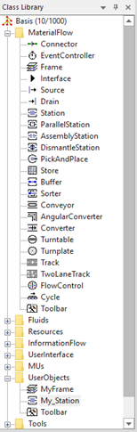

# Hierarchia

Softvér Plant simulation pozostáva z objektov, ktoré sa používajú na stavbu simulačného modelu. Jednotlivé objekty sú nastavené tak aby celkový simulačný model nadobúdal vlastnosti reálneho systému, ktorý simulujeme. V predchodzích príkladoch sme využívali základne objekty softvéru, ktorým sme nastavovali vlastnosti. Softvér umožňuje vytvárať si objekty nové, alebo využiť tie ktoré sú v základe implementované tým že zmeníme ich vlastnosti. V prípade pracovnej stanice sme vkladali základný objekt Station do modelu a potom zmenili jeho vlastnosti individuálne. Pre zjednodušenie práce je možné vytvoriť si model vlastný tak že skopirujeme pôvodný a zmeníme jeho vlastnosti. Pre vlastné objekty štandardne slúži adresár UserObjects nachádzajúci sa v Class Library. Prácu začneme tak, že objekt Station prekopírujeme s adresára MateralFlow do adresára UserObjects a premenujeme na My\_Station ako ukazujr obrázok:

<figure><figcaption>
Hierarchické zobrazenie adresára Materila Flow v Class Library
</figcaption></figure>

Tento objekt My\_Station je možné upraviť nasledovne:Na karte Times Processing time: na Triangle 10:00, 8:00, 12:00. Následne nastaviť Display Panel objektu MyStation podľa predošlej kapitoly. Pokiaľ je nastavenie uložené je možné využiť funkcionalitu Load/Save nastavenia Edit Display Panel. Teraz je možné namiesto objektu station použiť objekt My\_Station a nastavenia budú už predvolené vrátane Display Panelu.
