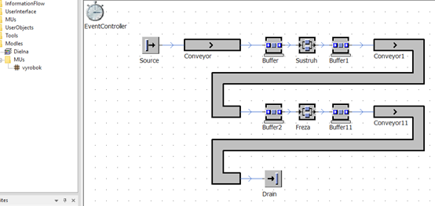

# Cvicenie: Model bez využitia hierarchie

Vytvoríme nový projekt podľa obrázka s nasledovným nastavením:Vytvorenie podadresára MUs, kde sa bude nachádzať jedno MU s názvom vyrobok. Hlavný Fame bude mať názov Dielna. Source Interval: Negexp 10:00, ParallelStation, Name: Sustruh, Processing time: Normal 20:00, 2:00, 1:00, 40:00, ParallelStation, Name: Freza, Processing time: Triangle 30:00, 25:00, 35:00. Ostatné parametre ostávajú nezmenené.

<figure><figcaption>
Príklad simulačného modelu bez využitia hierarchie
</figcaption></figure>

Pri dôkladnejšiej obhliadke simulačného modelu je vidieť, že pracovisko Sústruh aj fréza ma rovnaké zloženie a tvar. Nachádza sa tu jeden objekt ParallelStatin a dva objekty Buffer. V takomto prípade je vhodnejšie vytvoriť vlastný objekt a tento potom používať v simulačnom modly.
