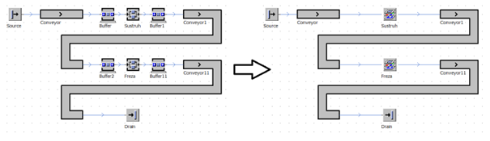
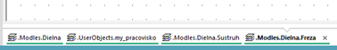
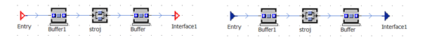

# Použitie vlastného objektu SubFrame v simulačnom modeli

V pôvodnom okne kde sa nachádza hlavný model môžeme vymazať objekty Buffer a ParallelStation s príslušnými objektmi Connector. Tieto je následne možné nahradiť nami vytvoreným objektom my\_pracovisko a zmeniť ich názvy na Sústruh a Fréza. Zmenu pôvodného modelu a modelu s použitým modelom my\_pracovisko znázorňuje obrázok:

<figure><figcaption>
Porovnanie vzhľadu simulačného modelu bez hierarchie a s využitím hierarchie
</figcaption></figure>

Nové objekty je možné otvárať dvojklikom ľavého tlačidla myši. Tieto objekty sa budú otvárať v nových oknách. Prepínanie medzi jednotlivými oknami je možné pomocou záložiek, ktoré sa nachádzajú v spodnej časti pracovného priestoru softvéru Plant Simulation. Pokiaľ je otvorené hlavné okno Dielna, trieda objektu my\_pracovisko aj obydva vytvorené objekty Sústruh a fréza, zobrazenie kariet ukazuje obrázok:

<figure><figcaption>
Zobrazenie kariet SubFrame
</figcaption></figure>

Pre lepšiu orientáciu, či máme otvorený objekt ktorý sme vytvárali, alebo či máme otvorený objekt ktorí je vložený do modelu a sú na ňom pripojené objekty Connector, je možné vidieť vo farbe objektu Interface. Na obrázku vľavo je otvorený pôvodne vytvorený objekt(červená farba objektov Interface), na obrázku vpravo je objekt ku ktorému sú pripojené objekty Connector(modrá farba objektov Interface).

<figure><figcaption>
Zmena objektu SubFrame po pripojení objektov Connector
</figcaption></figure>
