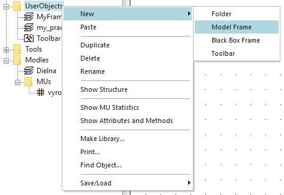
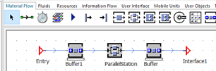

# Tvorba vlastného objektu SubFrame

Kliknutím pravým tlačidlom myši na adresár UserObjects a výberom New Model Frame sa vytvorí v adresári nový objekt Frame, ktorý môžeme následne premenovať(napr. my\_pracovisko). Postup tvorby znázorňuje obrázok:

<figure><figcaption>
Ukážka vytvárania nového objektu Frame
</figcaption></figure>

S týmto objektom je možné následne pracovať, je možné ho meniť a používať. V prípade že po otvorení nového objektu my\_pracovisko sa na ňom nachádza Event Controller, tak ho vymažeme, aby Frame ostal prazdny. Na takýto prázdny frame vytvoríme vzorové pracovisko. Vložíme objekt ParallelStation, objekt Buffer pred, objekt Buffer za a dva objekty Interface, ktoré sa nachádzajú na karte Materiál Flow. Objekty prepojíme objektom Connector podľa obrázka.

<figure><figcaption>
Ukážka vytvoreného pod-obiektu SubFrame
</figcaption></figure>

Meno objektu ParallelStation je možné zmeniť na stroj a Processing time na Triangle 30:00, 25:00, 35:00. Vytvorili sme objekt my\_pracovisko z východzím nastavením, ktoré bude aktívne po vložení objektu do simulačného modelu.
