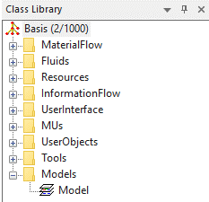

# Class Library

Plant simulation aplikácia poskytuje sadu základných objektov. Tieto základné objekty obsahujú základné vlastnosti ktoré umožňujú ich priame použitie v simulačnom modely. Avšak v reálnom svete je tak veľké množstvo konštalácií a objektov ktoré používajú rôzne množstvo vlastností a údajov,  že je nereálne ich obsiahnuť v jednom inštalačnom balíčku. To je dôvod prečo Plant simulation poskytuje základné objekty, ktoré je možné modifikovať akýmkoľvek spôsobom a tým vytvárať objekt požadovaných potrieb. Tieto objekty sa nazývajú _application ohjects_.&#x20;

Základné objekty poskytované Softvérom Plant simulation sú klasifikované do skupín na základe kritérií. Poznaním štruktúry objektov a ich kritérií je možné nájsť objekt ktorý má vlastnosti reálneho objektu, ktorý chceme použiť, alebo je možné vytvoriť objekt vlastný modifikovaním a kombináciou základného objektu Plant simulation. Základné objekty softvéru sa nachádzajú v _Class Library_. Základné zabudované objekty softvéru Plant simulation sú hierarchicky usporiadané použitím adresárovej štruktúry s podadresármi. S adresarovou štruktúrov Class Library sa dá pracovať formou pridávania premenovania a mazania adresárov. V základe Plant Simulation Class Library obsahuje deväť adresárov ako ukazuje obrázok:

<figure><figcaption>
Zobrazenie okna Class Library
</figcaption></figure>

MaterialFlow: sú objekty ktoré slúžia na prácu s objektmi Mobile Units (MU). MaterialFlow objekty umožňujú transport, ukladanie, a zmenu objektov MU. Ide o základné objekty Plant simulation ktoré slúžia na transport a spracovanie materiálu MU naprieč simulačným modelom.&#x20;

Fluids: sú objekty na simuláciu transportu volne prúdiacich materiálov ako kvapaliny a plyny. Medzi objekty fluids paria: trubky”Pipes”, zásobník“Tank”, zmiešavač“Mixer” atď.

Resources: tieto objekty umožňujú do simulácie vkladať pracovníkov, a simulovať ich činnosť. Pracovníci môžu poskytovať prácu na pracovných staniciach ako aj zabezpečovať prepravu a prenášania MU.

InformationFlow: tieto objekty zabezpečujú výmenu informácií medzi objektmi simulačného modelu. Jedná sa napr. o premenné, tabuľky prípadne súbory.

UserInterface: Objekty uľahčujú interakciu medzi užívateľom softvéru, a simulačným modelom. Slúžia na zadávanie a zobrazovanie informácií o modely a výsledky simulácie. Npr. grafy, reporty atď. &#x20;

MUs: (Moving Units) reprezentujú materiálový tok. Význam týchto objektov je, že MU sa presúvajú naprieč simulačným modelom. Medzi tieto objekty patrí: Časť”Part”, kontajner”Container” a transporter”Transporter”.

UserObjects: Nakoľko sa ne odporučuje meniť vlastnosti základných objektov Plant simulation, je zaužívané vytvárať kópie základných objektov a vkladať ich do adresára UserObject: V tomto adresári je možné meniť základné objekty podľa potrieb užívateľa tak aby bola zachovaná základná funkcionalita základných objektov.

Tools: je adresár na ukladanie špeciálnych funkcionalít modelu (add-ins), ktoré spracovávajú určité čiastkové špeciálne úlohy simulácie.

Models: Je pracovný adresár užívateľa softvéru na tvorbu simulačného modelu. Spravidla v tomto adresári užívateľ vytvára model na čo využíva hierarchickú štruktúru(podadresáre).
