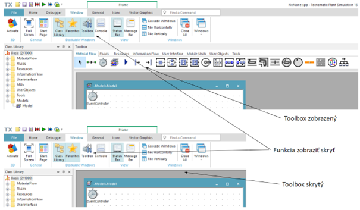

# Práca s Class Library a Toolbox

Tak ako okno Ribbon Bar aj okno Class library a Toolbox je možné zobrazovať a skrývať z dôvodu zväčšenia plochy okna hlavného Modelu. Funkciu pre zobrazenie a skrývanie jednotlivých okien, včetne Class Library a Toolbox je možné nájsť na položke Window ktorá sa nachádza na Ribbon Bar-e. Obrázok znázorňuje možnosti položky Window s príkladom zobrazeného a skryteho Toolbox-u.

<figure><figcaption>
Zobrazenie a skrývanie okien Class Library, Faworites Toolbox a Console
</figcaption></figure>
