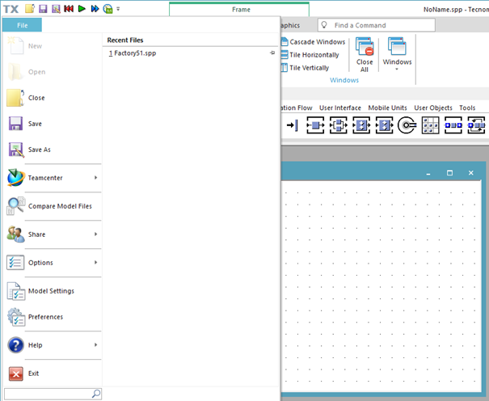
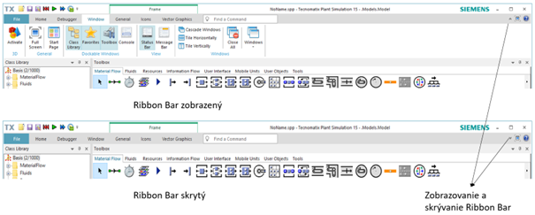

# Ribbon Bar

_Ribbon Bar_ je pozdĺž vrchnej časti hlavného programového okna. Ribbon Bar poskytuje základné príkazy a funkcie na prácu so softvérom. Ribbon Bar je rozdelený na jednotlivé karty, pričom každá karta obsahuje príbuznú sadu funkcionalít aplikácie. Základnou položkou Riboon Bar je File. Položka menu File slúži na základnú prácu so softvérom. Ukončenie práce na projekte, ukladanie projektu na disk, otvorenie nového projektu, nastavenie vlastností aplikácie, odkaz na nápovedu, ukončenie práce s aplikáciou atď. Položka menu file obsahuje štandardnú sadu funkcionalít, akú poskytuje väčšina aplikácii Windows. Štruktúru príkazov v menu položky file ukazuje obrázok:

<figure><figcaption>
Štruktúra príkazov v menu položky File
</figcaption></figure>

Pri práci na projekte je možné Ribbon Bar skryť a tým využívať väčšiu plochu okna modelu na prácu na projekte. Tlačidlo zobrazovania a skrývania Ribbon Bar s príkladmi zobrazenia ukazuje obrázok:

<figure><figcaption>
Zobrazenie Ribbon Bar
</figcaption></figure>

