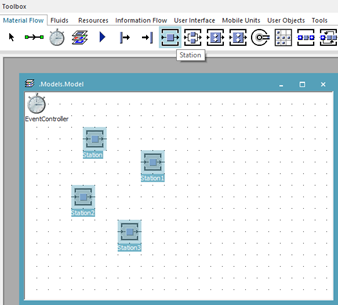
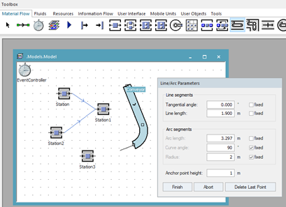
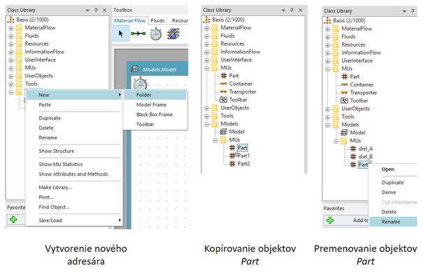

# Vkladanie modelov do simulačného modelu

Tak ako bolo spomenuté vyššie je možné použiť niekoľko spôsobov na vkladanie objektov do simulačného modelu. Efektívnou a rýchlou metódou je použiť Toolbox. Najprv je potrebné označiť objekt na Toolbox-e, následne kliknutím lavým tlačídlom myši je tento objekt vložený do modelu čo sa prejaví jeho zobrazením na okne Model. V prípade opakovaného vkladanie jedného typu objektu je možné s ľavým tlačidlom myši použiť kláves Ctrl. Týmto spôsobom je možné kopírovať do hlavného modelu okna viac objektov rovnakého typu ako ukazuje obrázok (vloženie štyroch objektov Station).

<figure><figcaption>
Vkladanie objektov Station do simulačného modelu
</figcaption></figure>

Objekty určené na prenos materiálu (Connector, Conveyor, Track, stď.. )sa vkladajú takým spôsobom, že po výbere objektu na Toolbar-e je potrebné ukázať na vstup alebo výstup objektu uloženého na okne objektu a kliknutím ľavého tlačídla myši vytvoriť prepojenie. V prípade zložitejších objektov slúžiacich na transport Material Flow sa používa dialog na vkladanie objektu. Príklad vloženia objektov Connector prepájajúcich objekty Station a dialógové okno objektu Conveyor znázorňuje obrázok

<figure><figcaption>
Prepojenie obkeltov typu Material Flow pomocou objektov typu Connector
</figcaption></figure>

V prípade že užívateľ vklada objekty pomocu Class library, vykonáva to spôsobom presúvania objektov pomocou myši držaním ľavého tlačídla myši obdobne ako pri presúvaní súborov medzi oknami v systéme Windows.

V prípade že užívateľ využíva základné objekty softvéru Plant simulation na to aby mohol ich vlastnosti upravovať tak aby pôvodné objekty ostali nezmenené, je potrebné vytvoriť kópie. Štandardne sa táto situácia využíva v prípade objektov Mobile Units (MU) nasledovne:

vytvorenie nového vlastného podadresára MUs v adresári Models, kliknutím pravým tlačidlom myši na Modles a vybratím funkcie New-Folder

prekopírovanie niekoľkých objektov Part do nového podadresára MUs držaním ľavého tlačidla myši spoločne s klávesou Ctrl,

premenovaním zkopirovaných MU podľa vlastných potrieb. **!!!nepoužívať pri menách objektov ani celkovo diakritiku a ani medzery!!!**
Postup vytvárania nových objektov typu Part v novom adresári MUs znázorňuje obrázok:

<figure><figcaption>
Vytváranie objektov materiálového toku MUs
</figcaption></figure>
