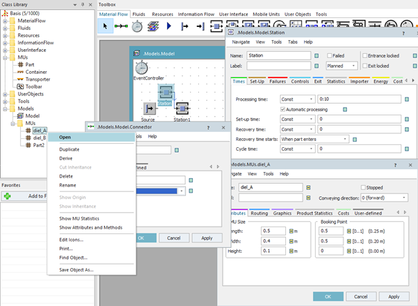

# Vlastnosti objektov a ich zmena

Objekt akéhokoľvek typu obsahuje vlastnosti, ktoré je možné meniť čím sa nastavuje celkový simulačný model. Vzhľadom na zložitosť objektu, niektoré majú viac vlastností, niektoré jednoduchšie(napr. Connector) majú vlastností menej. Pre nastavenie vlastností objektu sa otvára samostatné dialógové okno. Dialogové okno vlastností objektu sa otvára dvojklikom ľavým tlačídlom miši na objekt alebo kliknutím pravého tlačidly myši na objekt s výberom Open. Príklad dialógových okien objektov Station, Connector a Part ukazuje obrázok spolu s ukážkou výberu Open.

<figure><figcaption>
Dialógové okná nastavenia objektu Station
</figcaption></figure>

Skupiny objektov rovnakého typu(napr. objekty Material Flow) majú niektoré vlastnosti spoločné. Funkcionalita jednotlivých objektov, ich možnosti a nastavenia budú postupne vysvetlované na príkladoch.
