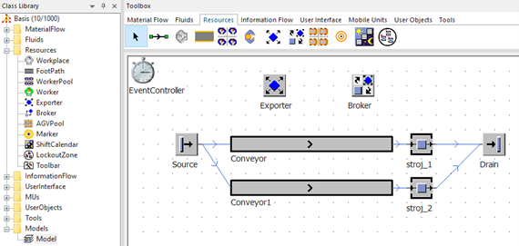

# Modelovanie pracovníkov a služieb



Pre využívanie modelovania pracovníkov a služieb softvér Plant Simulation využíva objekty ktoré sa nachádzajú v adresári Resources. Objekty Resources v adresári Class Library a na komponente Toolbox tnázorňuje obrázok:

<figure><figcaption>
Základný simlačný model pre ukážku využitia funkcie služieb
</figcaption></figure>
