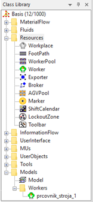
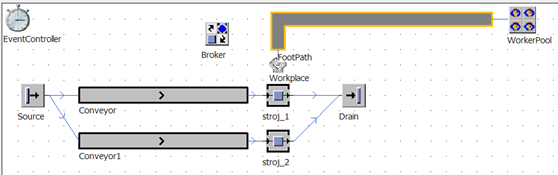
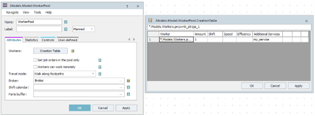
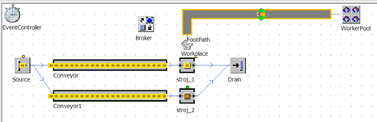
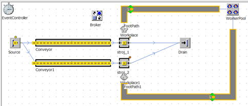

# Modelovanie obsluhy stroja

Predošlí prípad upravíme tak, že nebudeme na servis využívať objekt Exportér, ale objekt Worker. Začneme tým že vymažeme Exportér a ponecháme broker. V projekte vytvoríme zložku Workers do ktorej prekopírujeme objekt Worker zo zložky Resources a pomenujeme ho napríklad pracovník\_strooja\_1. Výsledok adresárovej štruktúry znázorňuje obrázok:

<figure><figcaption>
Zobrazenie hierarchickej štruktúry adresára Resources v Class Library
</figcaption></figure>

Ďalej do dokumentu vložíme WorkerPool Workplace a FootPath. Všetky tieto objekty sa nachádzajú na karte Resourcess panely Toolbox. Objekt FootPath je možné obdobne ako dopravník nastaviť tak aby tvar zodpovedal skutočnému tvaru cesty po ktorej prechádzajú pracovníci. WorkerPool Workplace a FootPath je potrebné prepojiť objektami Connector. Je vhodné, aby sa objekt Workplace nachádzal v blízkosti pracovnej stanice pre ktorý je určený. Podpora pracovnej stanice stroj\_1 s využitím pracovníkov je znázornená na obrázku:

<figure><figcaption>
Ukážka základného simulačného modelu s využitím pracovníkov
</figcaption></figure>

Nastavenie začneme od objektu pracoviska stroj\_1. Z predošlého nastavenia je nastavené, že objekt stroj\_1 vyžaduje servis s menom my\_service. Toto nastavenie je na karte importér. Vyžadovanie servisu my\_service môžeme ponechať s tým že tento servis bude ponúkať objekt pracovnik\_stroja\_1. Ďalej je potrebné skontrolovať nastavenie objektu Workplace. Na karte Attributes je potrebné skontrolovať, prípadne nastaviť v poly Station: pracovnú stanicu stroj\_1. V prípade, že je objekt Workplace umiestnený v blízkosti pracovnej stanice, prebehne toto nastavenie automaticky, je však potrebné to skontrolovať, prípadne nastaviť ručne. Finálnym nastavením je nastavenie objektu WorkerPool, kde je potrebné na karte Attributes nastaviť správny objekt Broker, a v tabuľke Creation Table nastaviť poskytovaný servis pracovníkom pracovník\_stroja\_1. Položku Worker v tabuľke je možné nastavovať pomocou ťahania myšou systémom drag-and-drop. Výsledok nastavenia znázorňuje obrázok:

<figure><figcaption>
Ukážka nastavenia objektu WorkerPool
</figcaption></figure>

V prípade, že na pracovisku objektu stroj\_2 nebudem vyžadovať službu, to znamená, že nastavenie objektu stroj\_2 na karte Importer nebude aktívne , po spustení simulácie bude model pracovať tak, že stroj\_2 bude pracovať okamžite, ale stroj\_1 bude čakať na servis ktorý mu bude ponúknutý, až vtedy keď príde pracovní (objekt pracovnik\_stroja\_1) a potom bude pracovať ako znázorňuje obrázok:

<figure><figcaption>
Ukážka simulačného modelu s využitím pracovníka pre model pracoviska stroj_1
</figcaption></figure>

Samozrejme je možné vytvoriť pracovníkov viac, alebo v možnostiach nastavenia objektu WorkerPool Creation table pridať viac pracovníkov na jeden servis a takto rozšíriť prácu pre všetky pracoviská ako ukazuje obrázok.

<figure><figcaption>
Ukážka simulačného modelu pre všetky pracoviská (stroj_1, stroj_2)
</figcaption></figure>
