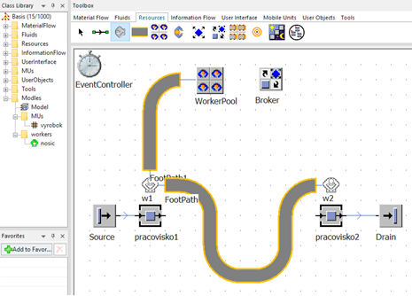
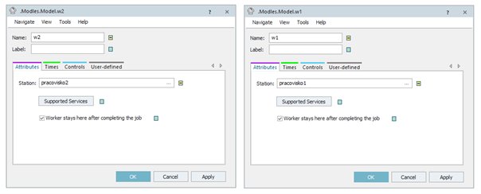
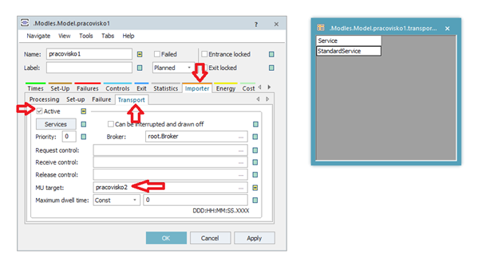
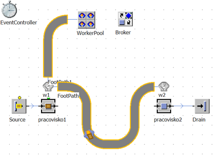

# Modelovanie pracovníkov prenášajúcich výrobky



V reálnom výrobnom systéme môže pracovník dostať za úlohu prenášať výrobky. Sumulačný model môže byť taktiež nastavený tak aby pracovník mohol presúvať objekty typu MU medzi objektami typu Material Flow. Na obrázku je znázornené jednoduché pracovisko, kde je potrebné prenášať objekty medzi objektami typu maerial flow praocivko1 a pracovisko. Zostavenie modelu je jednoduché, pozor na dôkladné pospájanie objektov Workplace (ktoré sú premenované na w1 a w2) s objektom WorkerPool a FootPath.

<figure><figcaption>
Ukážka základného simulačného modelu pre ukážku prenášania MU pomocou pracovníkov
</figcaption></figure>

Nastavenie začneme kontrolou priradenia objektov Workplace(w1,w2) k objektom Station(pracovisko1, pracovisko2). Otvorením nastavenia pracovisko1 a pracovisko2 misí byť na karte Attributes k položke Station: priradený správny objekt Station ako ukazuje obrázok.

<figure><figcaption>
Ukážka nastavenia objektov WorkerPool
</figcaption></figure>

Otvoríme nastavenie objektu pracovisko1 a prepneme sa na kartu Importér, následne na kartu Transport, kde je potrebné zvoliť Active a priradiť do políčka MU target: požadovaný cieľ (v našom prípade pracovisko2).

<figure><figcaption>
Ukážka nastavenia karty Importer objektu pracovisko1
</figcaption></figure>

Štandardne je nastavený servis StandardService a štandardne je tento servis poskytovaný. V prípade rozsiahlejšieho modelu je potrebné tieto parametre nastavovať osobitne. Simulačný model funguje nasledovne. Na objekte Source je generované MU, toto MU postupuje na pracovisko1 kde sa vyžiada StandardService, ktorý poskytne WorkerPool v podobe jedného praovníka. Tento pracovník po príchode na w1 dostane informáciu o cieľovej pozícii, kam ma MU preniesť a prenesie ho. Simuláciu modelu znázorňuje obrázok:

<figure><figcaption>
Ukážka výsledného simulačného modelu prenosu MU pomocou pracovníkov
</figcaption></figure>
