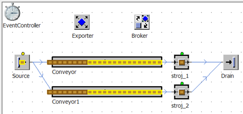

# Modelovanie zdrojov s využitím objektu Exporter

Exporter je objekt ktorý je nastavený tak, aby na základe potrieb Importéra poskytoval služby. Štandardne po vložení objektov Material Flow sú tieto nastavené tak, že importér nevyžaduje žiadnu službu, preto objekty pracujú na základe nastavených procesných časov. Žiadosť o službu sa nastavuje na karte Importer daného objektu. Na ukážku jednoduchej funkcionality Importer a Exporter zostavíme jednoduchý simulačný model s dvomi objektami Station ku ktorím budú viesť dva dopravníky. Generovanie objektov MU bude končtantné na nula sekúnd, čo bude mať za dôsledok pravidelné generovanie objektov kontinuálne. Objekty Station budú nazvané napr. stroj\_1 a stroj\_2 s nastaveným rovnakým procesným časom na 10 sekúnd. Model so spustenou simuláciou bez využitia objektov Importer Exporter znázorňuje obrázok:

<figure><figcaption>
Zobrazenie objektu Broker a Exporter v simulačnom modeli
</figcaption></figure>

Pracoviská stroj\_1 a stroj\_2 spracovávajú objekty MUs v rovnakých časových intervaloch, pretože sú tak nastavené. Na hlavný Frame simulačného modelu vložíme objekt Exportér a objekt Broker. Objekt broker je objekt hlavného manažéra objektov Exporter a Worker. Slúži na kompletné riadenie služieb(Resources).
