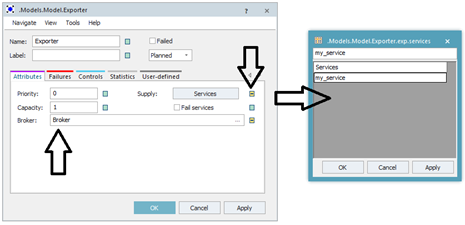

# Nastavenie objektu Exporter

Objekt Broker nie-je potrebné v základe nastavovať. Otvorením nastavenia objektu Exporter na karte Attributes je potrebné priradiť Broker a nastaviť ponúkané služby. Zaškrtnutím políčka dedičnosti je potrebné povoliť nastavovanie tabuľku služieb, ktorá sa otvorí kliknutím na tlačidlo Services. Otvoríme tabuľku a nastavíme my\_service meno vlastného servisu. Nastavovaciu kartu Attributes s nastaveným servisom my\_service znázorňuje obrázok:

<figure><figcaption>
Ukážka nastavenia tabuľky Services objektu Exporter
</figcaption></figure>

Objekt Exporter je teraz nastavený tak, že ponúka jeden servis (Capacity: 1) s menom my\_service. Následne je možné tento servis vyžadovať objektom Material Flow.
