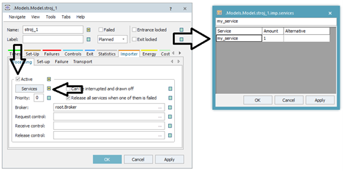

# Nastavenie objektu Importer

Importér sa nastavuje na objekte Material Flow od ktorého chceme aby vyžadoval službu. Napríklad ak chceme aby objekt stroj\_1 pracoval iba vtedy ak dostane od exportéra službu my\_service, nastavýme to nasledovne:

Otvoríme nastavenie objektu dvojklikom. Prepneme sa na kartu Importer, ktorá je ďalej rozdelená na karty(Processing, Set-Up, Failure a Transport). Keďže budeme vyžadovať servis na processing time ostaneme na karte Processing, zaškrtneme Active, zaškrtneme dedičnosť a poklepaním na tlačidlo Service sa otvorí tabuľka, kde je možné zapísať hodnotu my\_service. Ďalej je nutné vybrať správny model Broker, ktorý riadi exportér.

**!!! Dôležité je povoliť dedičnosť poklepaním na štvorček, pretože v opačnom prípade sa tabuľa javí, že ju nie-je možné editovať!!!**

Nastavenie importéra so službou my\_service znázorňuje obrázok:

<figure><figcaption>
Ukážka nastavenia karty Importer objektu stroj_1
</figcaption></figure>

Po spustení simulačného modelu je možné si všimnúť, že exportér poskytuje službu, a je aktívny, čo znázorňuje zelený led indikátor nad objektom Exporter   . V prípade nastavovania služieb je potrebné klásť doraz na mená služie. Pokiaľ Objekt Material Flow nedostane potrebnú službu ostane zablokovaný(nepracuje), čo je indikované oranžovou ledkou   .

Rovnakým spôsobom nastavíme aj importér objektu stroj\_2, tak aby vyžadoval službu my\_service. Po spustení simulácie je možné si všimnúť, že nie-je možné aby pracoval stroj\_1 aj stroj\_2 súčasne. Je to preto, že máme k dispozícii len jeden servis my\_service, tým pádom sa tieto objekty musia o servis deliť. Ako jednoduchá náprava v tomto prípade postačí nastaviť na karte Attributes objektu Exporter Capacity: na 2. To znamená že budeme mať my\_service dvakrát pre každý stroj.

Objekt Exporter aj Broker majú svoje štatistické údaje, ktoré je možné zobrazovať. Napríklad môžeme použiť pre objekt exportér graf pre štatistické zobrazenie časov.
