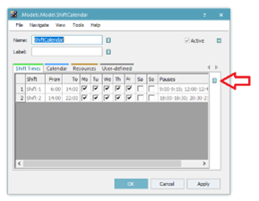

# Nastavenie pracovného kalendára

Pokiaľ chceme modelovať prácu pracovníkov na zmeny, môžeme využiť objekt   nasledovne. Vložíme objekt ShiftCalendár na hlavný pracovný Frame. Po rozkliknutí nastavenia objektu sú v základe nastavené dve zmeny s názvom Shift-1 a Shift-2. Počet zmien je neobmedzený. Je možné nastaviť pracovný čas a deň v týždni kedy bude zmena pracovať ako ukazuje obrázok:

<figure><figcaption>
Ukážka nastavenia práce na zmeny objektu ShiftCalendar
</figcaption></figure>

V prípade vlastnej editácie pracovného kalendára je potrebné odškrtnúť políčko dedičnosti inak sa bude tabuľka prejavovať akoby bola needitovateľná. Následne je potrebné pridať objekt ShiftCalendar v nastavení objektu WorkerPool a taktiež mená zmien v nastavení CreationTable tak ako ukazuje obrázok:

<figure><figcaption>
Ukážka nastavenia objektu WorkerPool pre prácu na zmeny
</figcaption></figure>
