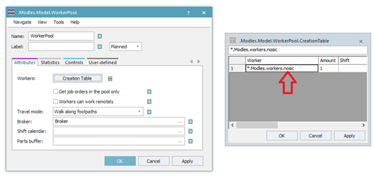
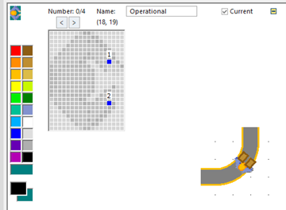

# Prenášanie viacerých kusov jedným pracovníkom

Pokiaľ je potrebné aby pracovník prenášal viac objektov MU je potrebné to nastaviť nasledovne. Vytvoríme si nového pracovníka, ktorého prekopírujeme do vlastnej adresárovej štruktúry a nazveme si ho vlastným názvom(napr. nosic). Skontrolujeme či je tento objekt worker správne nastavený vo vlastnostiach WorkerPool na karte Atributes Creation Table ako ukazuje obrázok:

<figure><figcaption>
Ukážka nastavenia Creation Table objektu WorkerPool
</figcaption></figure>

Následne je možné meniť vlastnosti objektu worker(nosic), prípadne aj jeho vzhľad. Dvojklikom na objekt nosic v Class Library sa otvoria jeho vlastnosti, kde na karte Attributes je možné zmeniť množstvo X-dimension: na 2 ako ukazuje obrázok:

<figure><figcaption>
Ukážka nastavenia objektu Worker pre prenos dvoch MUs
</figcaption></figure>

Znamená to, že kapacita ktorú bode môcť objekt Worker prenášať je 2 kusy. Kapacita možností objektu sa nastavuje ako trojdimenzionálne pole (X,Y,Z-dimension). Poklepaním pravým tlačidlom myši na objekt nosic v Class Library je možné otvoriť editor ikon, kde pomocou Add/Delete animation point je možné pridať body, prípadne zmeniť celý vzhľad objektu. Výsledok nastavenia a ukážku zo simulácie znázorňuje obrázok:

<figure><figcaption>
Ukážka nastavenia editora ikon objektu Worker
</figcaption></figure>
