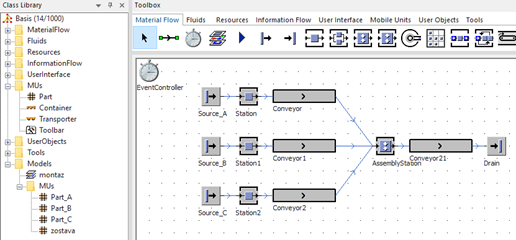
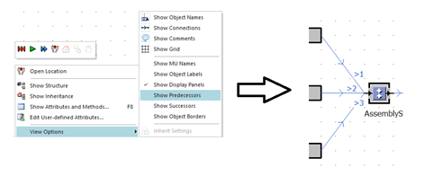

# Objekty Material Flow využiteľné pri simulácii montáže

Medzi základné objekty využitelné pri montáži patrí objekt AssemblyStation a objekt DismantleStation . Tieto objekty efektívne využívajú prácu s viacerími MUs. Základný princíp jednotlivých objektov ukážem na príklade. Adresárova štruktúra modelu bude štandardná, s jedným hlavným objektom Frame nazvaným montaz, jedným podadresárom MUs v ktorom budú štyri objekty Part nazvané Part\_A, Part\_B a Part\_C. Do hlavného okna simulačného modelu vložíme tri objekty Source, ktoré premenujeme na Source\_A, Source\_B a Source\_C. Tri objekty Station, štyri objekty Conveyor jeden objekt Drain a jeden objetk AssemblyStation. Objekty Material Flow budú pospájané objektami Connector tak ako ukazuje obrázok:

<figure><figcaption>
Ukážka využitia objektu AssemblyStation v montážnom simulačnom modely
</figcaption></figure>

Nastavenie objektov bude nasledovné: MU Part\_A bude vystupovať z objektu Source\_A po každej minúte. Rovnako aj objekt Part\_B aj Part\_C budú vystupovať zo Source\_B a Source\_C každú minútu. Predtým ako sa bude nastavovať pravidlo montáže objektu AssemblyStation je potrebné vedieť ako sú zapojené vstupné objekty Connector. Vstupy sú očíslované. Ich hodnoty sa dozvieme tak že kliknutím pravým tlačidlom myši kdekoľvek na formulár sa otvorí okno možností, kde zaškrtneme možnosť Show Predecessors. Obrázok zobrazuje princíp aktivácie zobrazenia vstupných pripojení s výsledkom na obiekte AssemblyStation.

<figure><figcaption>
Nastavenie objektu AssemblyStation na základe Predecessorov
</figcaption></figure>

Ako je zrejmé z obrázka keďže som pripojil prvý konektor vrchný má označenie vstupu 1, ako druhý pripojený bol stredný s číslom 2 a posledný bol spodný s číslom 3. Čísla predecessorov korešpondujú s poradím ako sú pripájané. Teraz je možné nastaviť pravidlo montáže objektu AssemblyStation.
