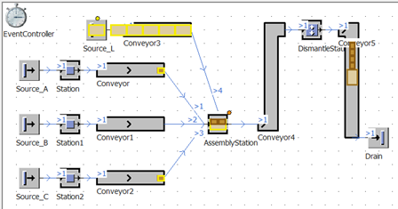

# DismantleStation

Objekt DismantleStation slúži na odoberanie objektov, ktoré sa nachádzajú na objekte Container. Jednoduchý príklad simulačného modelu s pridaným objektom DismantleStation a možnosťou odoberania objektov MUs Part ukazuje obrázok.

<figure><figcaption>
Ukážka využitia objektu DismantleStation v simulačnom modeli
</figcaption></figure>

Jediná vlastnosť ktorú je potrebné nastaviť v prípade objektu DismantleStation je na karte Attributes: Detach MUs.
