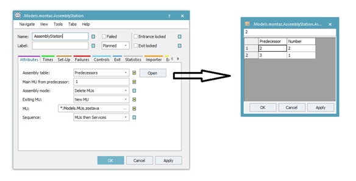
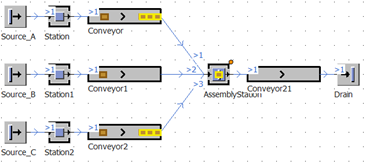

# Nastavenie objektu AssemblyStation

Predpokladajme, že chceme nastaviť nasledovné pravidlo: Je potrebné zostaviť jeden diel a objektu Part\_A, dva diely objketu Part\_B a jeden diel objektu Part\_C. Výstup bude objekt zostava. Otvoríme nastavenie objektu AssemblyStation na karte Attributes, ktorú nastavíme podľa obrázka.

<figure><figcaption>
Ukážka nastavenia tabuľky Predecessors
</figcaption></figure>

Po stlačení tlačidla Open sa otvorí tabuľka, kde sa nastavuje vstup Predecessor a počet objektov MUs ktoré sú potrebné. Dôležité je si uvedomiť, že v tomto prípade simulácie montáže je možné využiť s Main MU from predecessor: len jedno MU, a taktiež že v tabuľke sa nemôže nachádza číslo, ktoré je Main MU from predecessor:. Výsledok simulácie zobrazuje obrázok. Nakoľko so príchody všetkých MU nastavené rovnako a v prípade MU Part\_B sú potrebné dva kusy, na okrajových dopravníkoch ostávajú nevyužité MUs Part\_A a Part\_C.

<figure><figcaption>
Výsledný montážny simulačný model s využitím objektu AssemblyStation
</figcaption></figure>
