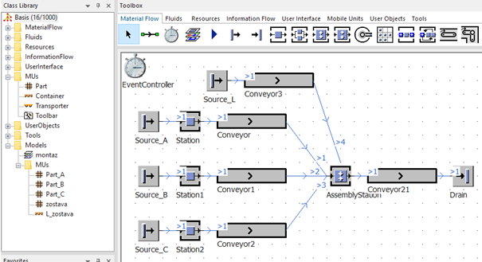
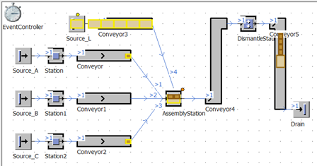

# Využitie MU typu Container v simulácii montáže

Objekt MU typu Contajner umožňuje ukladať a nosiť MU objekty typu part a dokonca aj objekty vlastné typu Contajner. Prevažne sa v simulačnom softvéry plant simulation používa na prepravu, a však v prípade montáže sa dá výhodne využiť napríklad ako primárny prvok na ktorý sa arobí montáž. Výhodou je, že objekty ktoré sú vkladané do kontajnera je možné aj z kontajnera odobrať. Budeme simulovať nasledovnú montáž. Na hlavnú jednotku ktorá bude reprezentovaná objektom Container vložíme jeden objekt Part\_A dva objekty Part\_B a jeden objekt Part\_C. Kompletný obiekt Contajner aj z ostatnými MUs necháme odísť objektom Drain.

V pôvodnom projekte je potrebné do adresára MUs pridať objekt Container, ktorý premenujeme na L\_zostava (názov zostava použiť nieje možné, pretože objekt s takýmto názvom sa už v simulačnom modely nachádza). Následne vložíme na hlavný Frame objekt Source, dopravník (objekt Conveyor) a celý model prepojíme objektami Connector. Výsledný model je zrejmí z obrázka.

<figure><figcaption>
Využitie MU objektu Container v montážnom simulačnom modeli
</figcaption></figure>

Nový zdroj ktorým je potrebné nastaviť generovanie objektov Container L\_zostava je nazvaný Source\_L. Čas generovania MUs je 0s, čo znamená, že objekty Contajner pôjdu po dopravníku za sebou bez časového oneskorenia. Keďže sme pripajali objekt Connector z najvrchnejšieho dopravníka ako posledný jeho predecessor je číslo 4. Tento predecessor č.4 bude tentokrát hlavný v prípade nastavenia objektu AssemblyStation. Nastavenie objektu AssemblyStation znázorňuje obrázok.

<figure><figcaption>
Ukážka nastavenia objektu AssemblyStation
</figcaption></figure>

Obiekt Container môže obsahovať určité množstvo iných MUs. V základe je nastavené maximálne množstvo na štyri objekty. Pokiaľ potrebujeme zväčšiť minimálne množstvo MU je potrebné to vykonať v nastaveniach vlastností objektu Container na karte Attributes X-dimension:, Y-dimension a Z-dimension. Výsledok simulácie montáže s využitím MU objektu Container znázorňuje obrázok:

<figure><figcaption>
Ukážka využitia objektu DismantleStation v simulačnom modeli
</figcaption></figure>

Jediná vlastnosť ktorú je potrebné nastaviť v prípade objektu DismantleStation je na karte Attributes: Detach MUs.
