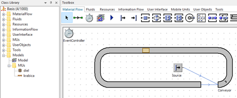
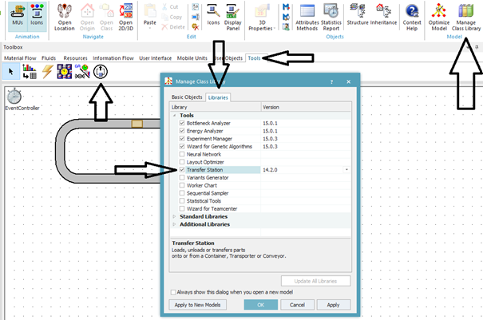
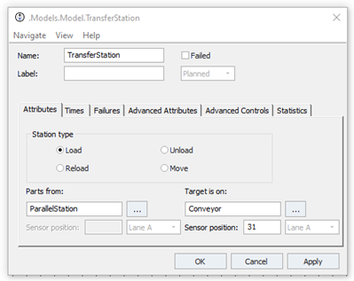
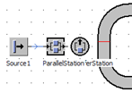
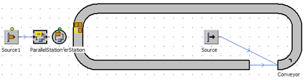
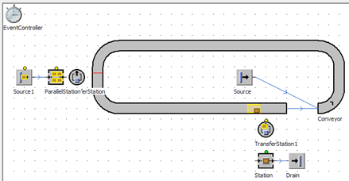

# Modelovanie prepravy pomocou pasívnych objektov typu Conveyor

Všetky doterajšie príklady využívali, jednoduchú pasivnu prepravu keď objekt MU bol položený na dopravník (objekt Conveyor) a prepravovaný. V nasledujúcom príklade využijeme dopravník, ktorý bude koncipovaný do kruhového tvaru, na dopravniku bude krabica, ktorá sa bude presúvať konštantnou rýchlosťou stále dookola. Do krabice budú vkladané diely (objekty Part), ktoré budú prepravované spolu s krabicou dookola.

Na hlavný Frame simulačného modelu vložíme dopravník (objekt Conveyor) a nastavíme jeho tvar tak aby objekt Container sa na ňom presúval dookola obr. Oblúky objektu dopravník sa vytvárajú pomocou ľavého tlačidla myši. spolu s klávesou ctrl. Výstup objektu Conveyor je spojený s jeho vstupom. Objekt Container je vložený pomocou objektu source, tak, že je nastavený počet vygenerovaných MU na jeden kus(vlastnosť objektu Source na karte Attributes Amounts:1). Výstup objektu source je spojený objektom Connector s vstupom objektu dopravník (Conveyor). Po spustení simulácie je vygenerovaný jeden objekt typu Container ktorý sa posúva na dopravníku (objekt Conveyor). Vzhľad modelu ukazuje obrázok:

<figure><figcaption>
Ukážka dopravníku pre prepravu MUs typu Container
</figcaption></figure>

Na nakladanie, vykladanie a transfér objektov MUs medzi objektami Container, Transporter a Conveyor sa využíva objekt Transfer Station, ktorý nieje implicitne aktivovaný v Class Library. Aktivácia sa vykonáva nasledovným postupom Na karte Home vpravo hore Riboon Bar sa nachádza funkcionalita Manage Class Librarry. Po kliknutí na Manage Class Library tlačidlo sa otvorí dialogove okno Manage Class Lybrarry, ktoré je rozdelené do dvoch častí: Basic Objects a Libraries. Prepnutím sa do časti Libraries je možné rozbaliť nástroje Tools, kde sa nachádza možnosť aktivácie triedy objektu Transfer Station. Po aktivácii sa bude objekt transfer station nachádzať na karte Tools Toolboxu a bude použiteľný v simulačnom modely. Postup aktivácie objektu Transfer station znázorňuje obrázok:

<figure><figcaption>
Postup vloženia objektu TransferStation v aplikácii Plant Simulation
</figcaption></figure>

Simulačný model rozšírime o objekt source ktorý bude generovať objekty typu Part, objekt ParallelStation a objekt TransferStation. Nastavenie generovania objektov Part (diel) bude konštantný každu sekundu. Nastavenie objektu TransferStation na karte Attributes bude podľa obrázka nasledovné.

<figure><figcaption>
Ukážka nastavovacích možností objektu TransferStation
</figcaption></figure>

Poklepaním na tri bodky vedľa nastavenia Parts from: vyberieme ParallelStation. Znamen to, že objekty budú prekladané z objektu ParallelStation. Následne je potrebné zvoliť kam majú byť tieto objekty preložené. Poklepaním na tri bodky v časti Target is On: zvolíme objekt Conveyor. Po potvrdení zvolenej možnosti poklepaním na Apply sa aktivuje pole Sensor possition:, kde je potrebné zadať pozíciu senzora. Senzor je miesto na objekte Conveyor, kde sa zastaví MU krabica a kde dôjde k prekladaniu. To miesto sa zadáva ako dĺžka od začiatku dopravníka včetne oblúkov. (pokiaľ je dopravník dlhý 10m a zadáme pozíciu senzora 5 prekladanie bude realizované v polovici dopravníka). Senzor, čiže miesto prekladania sa na dopravníku zvýrazní po potvrdení Apply ako červená čiara obrázok.

<figure><figcaption>
Zadávanie pozície senzora pre objekt TransferStation
</figcaption></figure>

Vzhľad simulačného modelu s nakladacou stanicou a zobrazením prekladania MUs typu Part znázorňuje obrázok.

<figure><figcaption>
Ukážka práce objektu TransferStation pri nakladaní objektov MU Container na dopravník
</figcaption></figure>

Objekty diel typu Part boli vložené do krabice, ktorá postupuje po dopravníku(objekte typu Conveyor). V ďalšej časti je potrebné objekty vyložiť. Do simulačného modelu na hlavný Frame pridáme objekty TransferStation, Station a Drain. Objekty MUs budú prekladané z dopravníku na objekt Station a ďalej postupovať do objektu Drain. Objekt Transfer station je potrebné nastaviť nasledovne: Station type: na Unload, Parts from: Conveyor, Target is on: Station a nastavenie Sensor position v prípade Conveyor tak, aby ležal pri objekte TransferStation. Výsledný model so spustenou simuláciou ukazuje obrázok:

<figure><figcaption>
Ukážka práce objektu TransferStation pri vykladaní objektov MU Container z dopravníka
</figcaption></figure>
