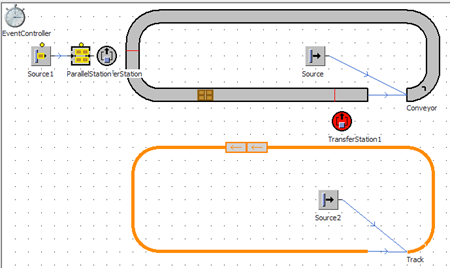
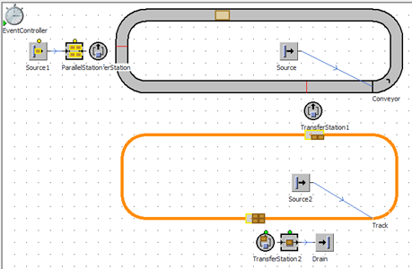

# Modelovanie prepravy pomocou pasívnych objektov typu Track

Na modelovanie pasívnej prepravy sa používajú objekty typu Track, TwoLaneTrack a MU typu Transporter. Z pôvodného modelu vymažeme objekt Station a Drain. Rovnakým spôsobom ako v prípade objektu dopravník navrhneme cestu dookola s objektom Track. Pomocou objektu Source privedieme na Track dva objekty MU typu Trasnporter (vozik). Simuláciu je možné spustiť a skontrolovať obiehanie MUs. Objekt TransferStation slúžiaci na vykladanie objektov z dopravníka zatiaľ nieje nastavený preto je zvýraznený červenou farbou ako na obrázku:

<figure><figcaption>
Ukážka použitia objektu Track v simulačnom modely
</figcaption></figure>

Objekt TransferStation1 je potrebné nastaviť nasledovne: Station type na Reload, Parts From: Conveyor a Target is on: Track. Zároveň je potrebné nastaviť správne polohy senzorov (poloha prekladania MU). Objekty je potrebné z vozíka vykladať na čo sa znovu dá využiť objekt TransferStation a vykladať objekty na objekt Station a posielať na objekt Drain. Pokiaľ simulačný model funguje je možné upraviť tvar dopravníka a cesty tak aby nebol viditeľný konektor ktorý prepája začiatok a koniec, čím vizualizácia nadobudne reálny tvar ako ukazuje výsledný tvar simulačného modelu na obrázku:

<figure><figcaption>
Výsledný simulačný model s využitím viacero typov objektov MUs a prepravy pomocou objektov Conveyor a Track
</figcaption></figure>
