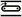
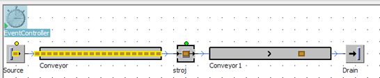

# Presúvanie MUs

V prípade jednoduchého modelu s predchádzajúceho príkladu bol použitý objekt Connector na presun MUs medzi objektami Source Station “ktorá bola následne premenovaná na stroj” a Drain. Znamená to, že akonáhle bolo vygenerované MU pomocou Source okamžite bolo odovzdané na stroj, a akonáhle stroj ukončil činnosť s týmto MU, okamžite ho odovzdal na objekt Drain, kde materiálový tok MUs modelu končí. V praxi takáto situácia zvyčajne nie-je. Obyčajne sú objekty materiálového toku premiestňované pomocou dopravníkov, vozíkov, žeriavov, prípadne iných zariadení určených na prepravu materiálu. SW plant simulation štandardne používa objekt Conveyor na presúvanie objektov MUs. Objekt Conveyor reprezentuje dopravník. Objekt Conveyor môže byť priamy, môže obsahovať oblúky, je možné nastaviť jeho rozmery, rýchlosť posúvania MUs atď. Objekt Conveyor je možné nájsť na Toolboxe, karte Material Flow, jeho ikona je : . Pôvodný simulačný model rozšírime o objekt Conveyor pred aj za stanicou stroj tým spôsobom že pôvodné objekty Connector vymažeme a nahradíme objektami Conveyor na ktoré následne pospajame objektami Connector. Výsledný upravený simulačný model so spustenou simuláciou znázorňuje obrázok:

<figure><figcaption>
Priebeh simulácie na modely s použitými dopravníkmi
</figcaption></figure>

Na tomto obrázku je vidieť objekty MUs ako sa posúvajú po dopravníkoch určitou rýchlosťou podľa toho v akých časových intervaloch sú generované ako rýchlo sú spracovávané stanicou stroj. Je možné nastaviť rýchlosť simulácie pomocou slidera objektu EventControler. Pokiaľ nastavíme rovnaký čas generovania objektov nastavim Source na 1min. a taktiež čas spracovania na stanici stroj na 1min., simulačný model pracuje stabilne bez toho aby sa dopravníky zapĺňali, a bez toho aby objekt generovania MUs Source bol blokovaný a čakal kým sa uvoľní dopravník Conveyor.
