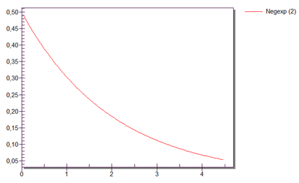

# Generovanie objektov MU v zadanom intervale

MU je možné generovať v danom intervale dookola výberom položky Time of creation Interval Adjustable. Pokiaľ je potrebné generovať nekonečné množstvo stále dookola je potrebné v poli Amount (množstvo) ponechať hodnotu -1. -1 pre SW Plant simulation znamená nekonečné množstvo! Pokiaľ potrebné generovať len určité množstvo, je možné toto množstvo zadať do položky Amount.

Interval generovania sa zadáva v poli Interval. Prvou položkou je funkcia pravdepodobnosti distribúcie. Základ systému tvorí niekoľko funkcií pravdepodobnosti ktoré je možné použiť. Samozrejme je možné vytvoriť si distribučné funkcie vlastné, prípadne využívať konkrétny zoznam vytvorený napríklad zo záznamu reálneho systému. V prípade využívania základných funkcií pravdepodobnosti distribúcie nachádzajúcich sa v systéme je potrebné na ich implementáciu využívať help SW Plant Simulation. Vysvetlím distribúciu negatívne exponenciálnu, ktorú je možné vybrať ako Negexp.

Negatívne exponenciálna distribúcia je kontinuálna distribúcia. Volá sa negatívna, pretože je negatívne znamienko v exponente. Pre realizáciu sa využíva kladná časť funkcie. Funkcia má nasledovný tvar:

$$
F(x) = 1 -exp(- \frac{x} {\beta})
$$

Parameter beta 𝞫 určuje priemernú hodnotu. Parameter 𝞫 musí byť kladná hodnota a musí byť väčší ako 0. V prípade potreby je možné zadať spodnú a hornú hranicu funkcie distribúcie. Príklad na obrázku znázorňuje negatívne exponenciálnu distribúciu pri použití parametru 𝞫=2.

<figure><figcaption>
Graf exponenciálnej distribúcie generovania objektov MUs
</figcaption></figure>

V prípade metody Interval Adjustable je možné zadať parameter štartu Start a parameter konca Stop.

