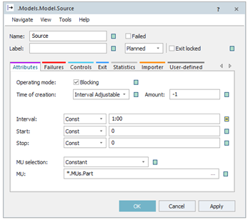
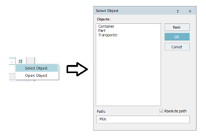
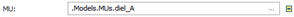
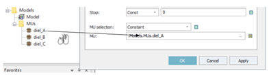
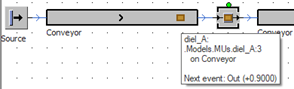

# Generovanie “objektov MUs” pomocou objektu Source

Na generovanie objektov MUs sa používa objekt Source. Z objektu Source objekty MUs vstupujú do simulačného modelu, prechádzajú ním na zaklade nastavenie modelu pomocou objektov Material Flow a potom sa strácajú v objektoch Drain. Na pôvodnom jednoduchom modly ukážem základné možnosti generovania MUs tak aby sa model zhodoval s prípadmi, ktoré môžu reálne nastať.

Základné nastavenie objektu Source sa nachádza na karte Attributes, jej možnosti a vzhľad ukazuje obrázok:

<figure><figcaption>
Dialogové okno nastavovania objektu Source
</figcaption></figure>

Z obrázku je zrejme “na základe okienka dedičnosti ”, že jediná vlastnosť ktorá je zmenená je interval generovania na 1min. Základom nastavenia je informácia aké MU chceme generovať. Toto nastavenie je v dolnej časti karty Attributes . Je niekoľko možností ako nastaviť túto položku. Jednou z možností je kliknutím na … a výberom Select Object otvoriť dialógové okno výberu MUs ako ukazuje obrázok:

<figure><figcaption>
Výber generovaných mobilných objektov MUs
</figcaption></figure>

V spodnej časti sa nachádza informácia v akom adresáre sa aktuálne nachádzame. V tomto adresári sa nachádzajú objekty “Container, Part, Transporter”. O úroveň vyššie v adresárovej štruktúre objektu sa dostaneme poklepaním na tlačidlo . Týmto spôsobom môžeme prechádzať adresárovú štruktúru projektu. Preskúmaním Class Library vieme, že objekty MUs ktoré chceme používať v projekte simulačnéhom modelu sa nachádzajú : Models/MUs. Jedná sa o objekty “diel\_A, diel\_B, diel\_C”. Prejdeme do adresára a vyberieme objekt “diel\_A”. Výber sa prejaví nasledovne:

Ďalšia možnosť výberu MU je pretiahnutím pomocou myši so stlačeným ľavým tlačidlom priamo z Class Library a pustením v časti kde má byť informácia o MU. Princíp zadávania znázorňuje obr.

<figure><figcaption>
Výber generovaných mobilných objektov MUs pomocou myši
</figcaption></figure>

Po tejto zmene po spustení simulácie, následným zastavením a podržaním kurzora myši nad daným objektom MU je vidieť balónové okno informácií o danom objekte ako ukazuje obrázok:

<figure><figcaption>
Ukážka zobrazenia informácií o objekte pomocou balónového okna
</figcaption></figure>

Z aktuálnej balónovej informácie je zrejmé že sa jedná o objekt diel\_A, je to tretí kus v poradí a nachádza sa na objekte Conveyor.
