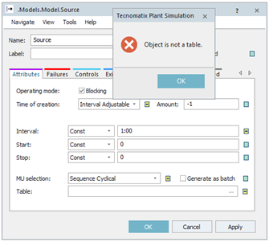
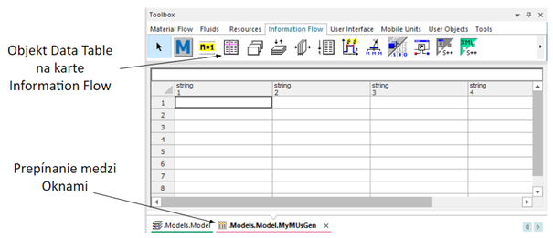
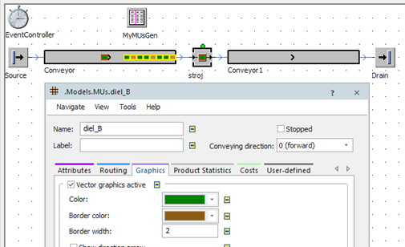
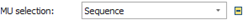

# Generovanie viac typov MU pomocou jedneho zdroja Source

Pokiaľ chceme aby zdroj Source generoval viac typov MUs môžeme na to použiť funkciu Mu selection: kde je možné vybrať Sequence Cyclical. Pokiaľ vyberieme túto možnosť a klikneme na "Apply" , vypíše sa chybové hlásenie Object is not a table, ako na obrázku.

<figure><figcaption>
Chybové hlásenie objektu
</figcaption></figure>

Výberom možnosti Mu selection Sequence Cyclical je potrebné ak o vstup zadať tabulku Table, ktorú je potrebné vytvoriť. Karta Information Flow na paneli Toolbox sa nachádza objekt Data Table  ktorý vložíme do hlavného okna obdobne ako ostatné objekty simulačného modelu. Po vložení na hlavný Frame a kliknutím pravého tlačidla myši je možné Objekt Datatable premenovať podľa vlastných potrieb napr “MyMUsGen”. Dvojklikom na objekt tabuľky sa otvorí tabuľka s riadkami a stĺpcami ako ukazuje obrázok. Medzi kartou Frame a zobrazením tabulky je možné prechádzať prepínaním v spodnej časti okna.

<figure><figcaption>
Ukážka práce s objektom Data Table
</figcaption></figure>

Vytvorením tabuľky je možné ukladať do tabulky dáta, ktoré budú následne využívané v simulačnom modeli. Otvoríme vlastnosti Source c položke MU selection: vyberieme možnosť Sequence Cyclical a do políčka Table: napíšeme meno vytvorenej tabuľky “MyMUsGen”, alebo tabulku vložíme metofou pretiahnutia myšou so stlačeným lavým tlačidlom. Tabuľka sa teraz používa na generovanie MU, pričom sa automaticky naformátujú stĺpce, a môžu sa do nej vkladať údaje. Do tabuľky vložíme údaje podľa nasledujúceho obrázka:(MU je možné vkladať systémom preťahovania myšou).

<figure><figcaption>
Nastavovanie objektu Data Table pre generovanie objektov MUs
</figcaption></figure>

Príklad funguje nasledovne: V prvej minúte sa vygeneruje diel\_A, v druhej diel\_B, v tretej diel\_B, vo štvrtej diel\_A, ...atď stále dookola. Po spustení simulácie sa zmena neprejaví. Na zrozumiteľné rozpoznanie MUs je vhodné zmeniť ich vzhľad. Výberom MU z Class Library pomocou dvojklikom myši alebo poklepaním pravého tlačidla myši a výberom Open sa zobrazí nastavovacie okno vlastností modelu MU. Výberom karty Graphics sa zobrazia možnosti nastavenia vzhľadu objektu MU. Pokiaľ ponecháme zaškrtnuté políčko Vector graphics active, je možné zmeniť základný farbu Color: objektu MU. Takýmto spôsobom je možné napr. zmeniť diel\_B, aby sa zobrazoval zelenou farbou. Nastavenie zmeny farby MU so spustenou simuláciou generovania viac typov MUs znázorňuje obrázok:

<figure><figcaption>
Zmena farby vektorovej grafiky objektov MUs
</figcaption></figure>

Pokiaľ sa majú MUs vygenerovať len raz, nie cyklicky dookola je možné v nastaveniach objektu source vybrať v časti MU selection: položku Sequence .
