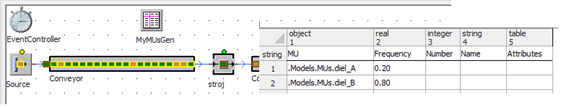

# Náhodné generovanie objektov MUs

Ďalšou možnosťou výberu MU selection, je možnosť random. Pri výbere tejto možnosti sa taktiež vkladá tabuľka, avšak nakoľko táto tabuľka je nositeľom iných údajov je potrebné aby bola preformátovaná. Na preformátovanie tabulky s možnou stratou dát softvér upozorní hlásením. V tabuľke pre výber random sa nachádzajú tieto údaje:

* MU: Objekt ktorý sa bude generovať
* Frequency: Podiel generovania
* Number: Počet vygenerovaných objektov v danú chvíľu
* Name: Názov objektu (nie-je potrebné zadávať)
* Attributes: Atribút objektu (nie-je potrebné zadáva)

Príklad nastavenie tabuľky Random z dôsledkom na simuláciu znázorňuje obrázok.

<figure><figcaption>
Nastavenie náhodného generovania objektov MUs
</figcaption></figure>

Nastavenie objektu Source MU selection na Percentage má rovnaký efekt ako Random s tým rozdielom, že hodnota podielu generovania MUs sa nastavuje v percentách.
