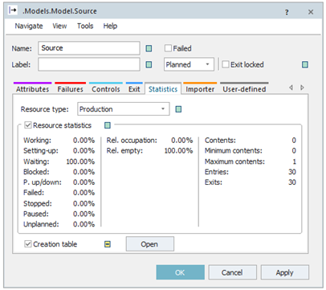
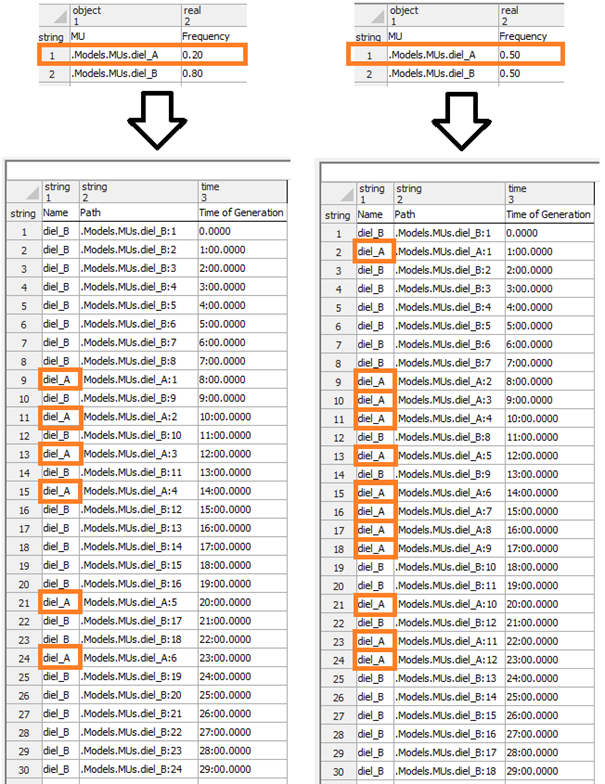
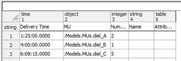

# Záznam vygenerovaných MUs do tabuľky

Objekt Source umožňuje zaznamenať čas a typ vygenerovaných objektov MUs počas svojej funkčnosti. Túto funkciu je možné aktivovať na karte Statistics nastavenia objektu Source. Na tejto karte sa nachádza základná štatistika funkčnosti objektu. V spodnej časti je zaškrtávacie políčko Creation Table. Zaškrtnutím tohto políčka sa vytvára tabulka ktorú je potom možné zobraziť poklepaním na tlačidlo Open. Príklad na obrázku znázorňuje kartu Statistics objektu Source.

<figure><figcaption>
Zobrazenie karty Statistic objektu Source
</figcaption></figure>

Tabulku je možné exportovať, použiť na analýzu, prípadne v inom simulačnom modeli na generovanie MUs. Obrázok znázorňuje vygenerované tabulky, pri dvoch rôznych nastaveniach počas prvých 30 minút simulácie. Generovanie MU je nastavené ako konštanta na jednu minútu. Generujú sa MU diel\_A a MU diel\_B. NaStavenie generovania medzi MU sú náhodné pričom v prvom prípade chceme aby v prípade vľavo bol podiel 2 ku 8, čiže dielov A je podstatne menej. V prípade na obrázku vpravo je pomer dielov nastavený rovnako.

<figure><figcaption>
Ukážka tabulky záznamu generovaných objektov MUs
</figcaption></figure>

V prípade, že je zvolená možnosť Numer Adjustable, tak sa generuje len daný počet objektov MU naraz. V tomto prípade nemôže byť zadaná voľba Amount: nekonečno, teda -1. Ďalšou možnosťou je možnosť Time of creation: Delivery Table. Delivery Table umožňuje zadávať presný čas, množstvo a meno MU. Tvar a formás s príkladom, delivery table zobrazuje obrázok:

<figure><figcaption>
Formát tabuľky DeliveryTable
</figcaption></figure>
