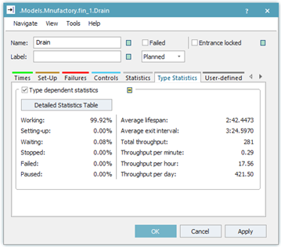
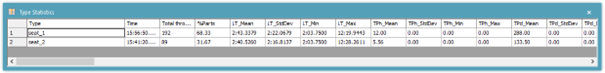

# Štatistiky a grafy

Väčšina objektov je schopná zbierať spracovávať a ukazovať základné štatistiky. Tieto štatistiky sa spravidla nachádzajú na karte Statistics daného objektu. Zvláštnosťou je objekt Drain, ktorý naviac obsahuje kartu Type statistics, kde sa nachádzajú ďalšie štatistické údaje obrázok:

<figure><figcaption>
Ukážka štatistických údajov na karte Type Statistic objektu Drain
</figcaption></figure>

Po stlačení tlačidla Detailed Statistic Table  sa zobrazia kompletné štatistické údaje o každom MU oddelene obrázok:

<figure><figcaption>
Zobrazenie oddelených štatistických údajov o mobilných objektoch
</figcaption></figure>