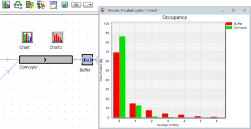

# Histogram

Zobrazenie formou histogramu je možné využiť v prípade, keď napríklad potrebujeme informáciu o počte objektov MUs uložených v zásobníku (objekt Buffer), alebo o počte objektov ktoré sa prepravujú pomocou dopravníku (objekt Conveyor).

Na základne pracovné prostredie vložíme nový objekt Chart. Tento sa automaticky premenuje na Chart1, nakoľko jeden objekt s týmto názvom už prostredie obsahuje. Vyberieme objekt Conveyor a Buffer a presunieme nad objekt Chart1. Výberom Occupancy potvrdíme možnosť zobrazenia grafu v režime Histogram ako ukazuje obrázok:

<figure><figcaption>
Zobrazenie histogramu
</figcaption></figure>

Červenou farbou sú zobrazené štatistické dáta objektu Buffer, zelenou farbou sú zobrazené štatistické dáta objektu Conveyor. Os X znázorňuje počet MUs, os Y znázorňuje percentuálne obdobie akým bol objekt zaplnený daným počtom MUs. Z grafu je zrejmé väčšinu času boli objekty prázdne, to znamená že počet MUs bol nula, potom zhruba 15% celkového času boli objekty Buffer a Conveyor zaťažený jedným MUs. Aj v prípade zobrazenia grafu formou Histogram je možné meniť vzhľad a nastavenie zobrazovacích dát vo vlastnostiach objektu Chart.
