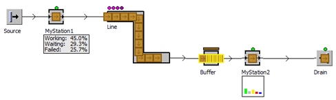

# Object Display Panel (zobrazenie)

Objekt Display Panel sa využíva na zobrazovanie informácií a štatistík. Pokiaľ nastavíme Display Panel priamo u objektov ktoré následne vkladáme do simulačného softvéru, budú sa tieto údaje zobrazovať priamo pri objektoch v hlavnom okne. Príklad Display Panelu objektov vložených do simulačného modelu zobrazuje obrázok. Softvér Plant simulation v základe podporuje tri typy objektu Display Panel. Zobrazuje hodnoty ako text, ako bars a ako Leds.

<figure><figcaption>
Zobrazenie možností objektu Display Panel
</figcaption></figure>
