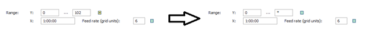
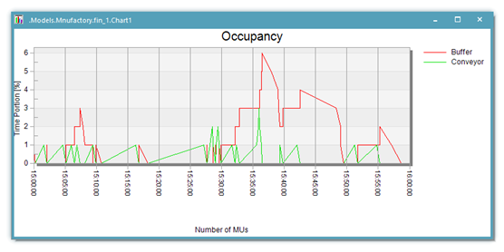

# Plotter

Pokiaľ potrebujeme vidieť vývoj nejakého údaju v časej možné použiť zobrazenie Plotter. V prípade zobrazenie pomocou funkcie plotter je os X časová os. Pôvodné zobrazenie objektu Chart1 je možné zmeniť nasledovne. V nastavovacích vlastnostiach objektu Chart1 na karte Display zmeňme položku Category na Plotter . Potvrdením Apply alebo OK sa nastaví graf. Spustením simulácie sa zobrazje zmena Počtu MUs v čase. Maximálna hodnota v ose Y je však veľká, preto sa graf zobrazuje len v spodnej čast. V takomto prípade je potrebné nastaviť rozmedzie Y-psilónových hodnôt nasledovne. Na karte Axes sa nachádza položka Range:, kde je možné nastaviť rozmedzie súradníc X aj Y. Je vhodné využiť funkcionalitu dedičnosti(zeleno žltý štvorček) a vynulovať tieto údaje. Postup znázorňuje obrázok:

<figure><figcaption>
Nastavenie zobrazovacích súradníc grafu
</figcaption></figure>

Výsledný graf časového zobrazenie množstva MUs na dopravníku (objekt Conveyor) a v zásobníku (objekt Buffer) zobrazuje obrázok:

<figure><figcaption>
Zobrazenie časových údajov v grafe
</figcaption></figure>
