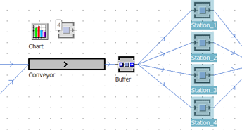
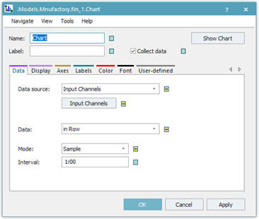
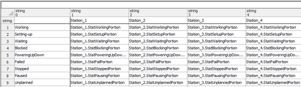
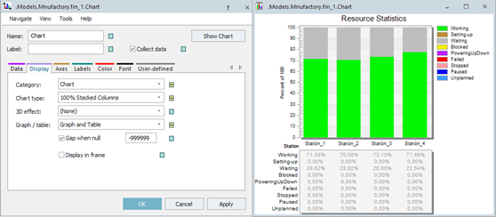

# Využívanie grafov typu Chart

Funkciu zobrazenia grafu aktivujeme vložením objektu Chart  z karty User Interface panela Toolbox. Po vložení grafu treba objektu prideliť dáta ktoré chceme zobrazovať. Napríklad zobrazenie štatistických údajov jednotlivých staníc vykonáme tak, že vyberieme stanice a pomocou pretiahnutia myšou s ľavým tlačídlom tieto stanice vložíme na objekt Chart. Princíp ukazuje obrázok:

<figure><figcaption>
Princíp vkladania a nastavenie objektu Chart
</figcaption></figure>

Následne výberom hodnoty Resource Statistics zobrazíme graf. Graf v stĺpcovom tvare zobrazuje štatistické údaje práce jednotlivých pracovných staníc. Hodnoty v grafe sa zobrazujú len vtedy ak je aktivna simulácia alebo prebehol určitý čas simulácie. Okno zobrazenia grafu je možné vypnúť poklepaním na krížik okna grafu v pravom hornom rohu. Pokiaľ chceme zobrazenie grafu obnoviť je možné na objekt grafu poklepať pravým tlačidlom myši s následným výberom položky Show, a graf sa znovu zobrazí. Nastavenie grafu je možné vyvolať dvojklikom ľavým tlačidlom myši, alebo pravým tlačidlom s výberom hodnoty Open. Dialog nastavovacích možností grafu ukazuje obrázok:

<figure><figcaption>
Ukážka nastavovacích možností grafov
</figcaption></figure>

Na karte Data je možné nastaviť dáta ktoré sa zobrazujú. Kliknutím na tlačidlo Imput Channels sa zobrazí tabuľka so vstupnými hodnotami ktoré sa aktuálne zobrazujú. Túto tabuľku je možné upraviť. Tabuľku štatistických hodnôt práce staníc zobrazuje obrázok:

<figure><figcaption>
Zobrazenie tabuľky dát ktoré sa vyhodnocujú pomocou objektu Chart
</figcaption></figure>

Na ďalších kartách je možné nastaviť ďalšie vlastnosti objektu Chart. Napríklad na karte Display je možné zvoliť v položke Graph / table: možnosť zobrazenia údajov aj v podobe tabuľky. Výsledné zobrazenie štatistických údajov jednotlivých staníc vo forme tabulky aj grafu zobrazuje obrázok:

<figure><figcaption>
Zobrazenie dát vo forme tabuľky aj grafu
</figcaption></figure>
