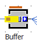

# Zobrazenie display panel ako Bars

Ďalšou možnosťou je využiť zobrazenie Display Panel ako Bar. Napríklad, keď chceme zobraziť množstvo MUs nachádzajúcich sa v zásobníku (Objekt Buffer).

Klikneme na objekt Buffer pravým tlačídlom myši a vyberieme možnosť Edit Display Panel: Aktivujeme Display panel zaškrtnutím políčka Active aby sa zobrazoval pri objekte Buffer. Position nastavíme X: -14, Y: -19, Size Widt: 29, Height: 3, Border color: a Background color: je potrebné nastaviť na Transparent. Následne pomocou tlačidla New je možné pridať Element a nastaviť jeho parametre na: Value: numMU, Position: X:0, Y:0, Type: Bar, Color: hnedý, Length: 29, Width: 5, Direction: Right a Maximum value: 10. Priebeh simulácie a množstvo MUs nachádzajúcich sa v objekte Buffer znázorňuje obrázok.

<figure><figcaption>
Panel ako Bars
</figcaption></figure>
