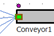

# Zobrazenie Display Panel ako LED

Predpokladajme, že chceme zobraziť nekalý stav objektu. Napríklad chceme zobraziť stav keď sa na dopravníku nachádza objekt MU. Na takýto stav je možné použiť Display panel v režime LED. Otvoríme nastavenie Edit Display Panel objektu Conveyor a nastavíme nasledovne: Zaškrtnúť Active: Position X: 0, Y: -20, Width: 32, Height: 8, Border color: a Background color: nastaviť na transparent. Pridať nový element ktorý nastaviť nasledovne: Value: occupied, Position: X: 0, Y: 0, Type na LED, Color: napr. ružový a Width: 6. Pri tomto nastavení keď bude na dopravníku MU zasvieti ledka ako ukazuje obrázok:

<figure><figcaption>
Panel ako LED
</figcaption></figure>

