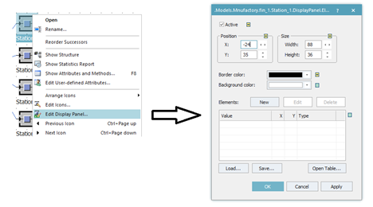
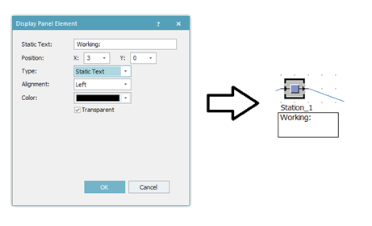
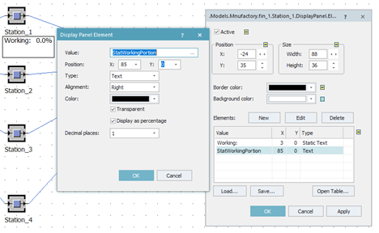
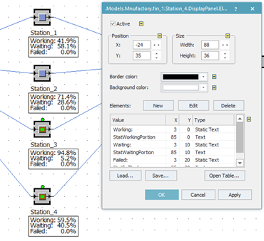

# Zobrazenie Display Panel ako text

Ako príklad nastavíme Display Panel pre objekt Station\_1. Kliknutím na objekt pravým tlačidlom myši a výberom Edit Display Panel… sa otvorí nastavovacie okno objektu Display panel. Display panel sa aktivuje zaškrtnutím Active, nastavíme Position X: -24 Y: 35, Size Width: 88, Height: 36 a Border color na čiernu tak ako ukazuje obrázok:

<figure><figcaption>
Nastavenie objektu Display Panel pre zobrazovanie textových informácií
</figcaption></figure>

V spodnej časti nastavovacie okna sa nachádza tabuľka Elements, kde je možné pridávať hodnoty, ktoré požadujeme zobrazovať. Kliknutím na New je možné pridať nový element. Ako prvé pridáme statický text ako ukazuje obrázok:

<figure><figcaption>
Ukážka pridávania textového elementu do objektu Display Panel
</figcaption></figure>

Ďalší element bude hodnota ktorá bude ukazovať využiteľnosť stanice. Kliknutím na New otvoríme nastavovacie okno ktoré nastavíme nasledovne: Value vyberieme na StatWorkingPortion, Position: X:85, Y:0, Type:Text, Alignment: Right, Color: čierna, zaškrtneme Transparent a Display as percentage a Decimal plates: 1. Nastavenie s výsledkom znázorňuje obrázok:

<figure><figcaption>
Príklad nastavenia objektu Display Panel so zobrazeným výsledkom
</figcaption></figure>

Obdobne sa dajú nastaviť aj ostatné hodnoty (StatWaitPortion a StatFailedPortion). Pozor na zmenu súradnice Y, ťím sa posunú Elementy tak, aby sa zobrazovali pod seba, prípadne zmnou súradnice X vedľa seba. V prípade že chceme nastavenie použiť pre ostatné stanice je možné využiť funkcionalitu Save a Load a nastavenie uložiť na disk a potom následne použiť na ostatné objekty. Výsledok nastavenia textovej formy Display Panel pre všetky stanice počas simulácie znázorňuje obrázok:

<figure><figcaption>
Zobrazenie objektov Display Panel pre všetky pracovné stanice
</figcaption></figure>
