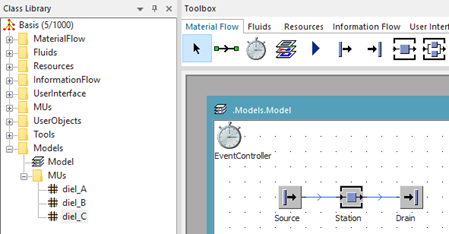
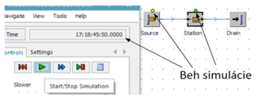

# Vytvorenie základného simulačného modelu

Na hlavné okno model presuňme objekt Source, Station a Drain. Tieto objekty prepojíme konektorom. Výsledný jednoduchý model ukazuje obrázok.

<figure><figcaption>
Základný simulačný model
</figcaption></figure>

Beh simulačného modelu ovláda objekt EventController. Tento objekt sa implicitne nachádza po vytvorení nového projektu na hlavnom okne model. Pokiaľ sa objekt EventControler na hlavnom okne nenachádza je možné ho doplniť za pomoci ToolBox panelu z karty Material Flow. Po otvorení vlastností objektu EventControler(napr. dvojklikom) sa otvorí nastavovacie dialogove okno EventContorler obr:

<figure><figcaption>
Nastavovacie okno objektu EventController
</figcaption></figure>

Simuláciu je možné spustiť pomocou tlačidla Štart/Stop simulácia. Beh simulácie sa prejaví narastajúcim časom v informačnom okne Time a preblikávaním status lediek na simulačnom modeli ako ukazuje obr

<figure><figcaption>
Ukážka behu základného simulačného modelu
</figcaption></figure>

Zároveň sa na jednotlivých objektoch zobrazujú objekty MUs, čo sú v našom jednoduchom prípade objekty typu Part. Posúvaním nastavenia rýchlosti simulácie sa koriguje rýchlosť simulácie čo sa prejaví rýchlosťou ubiehajúceho času a zobrazovaním MUs objektov. Simuláciu je možné zastaviť opätovným stlačením tlačidla Štart/Stop. Reset simulácie je možné vykonať poklepaním na tlačidlo reset. Resetuje sa objekt EventControler, vynuluje sa odpočítavanie času vynuluje sa používané MUs a je možné simuláciu opätovne spustiť od východzieho stavu. V prípade, že chceme využiť funkcionalitu rýchle dopredu, a prejsť celou simuláciou v najkratšom možnom čase, je potrebné nastaviť dĺžku celkovej simulácie. Toto sa vykonáva na karte Settings objektu EventControler na položke End.
